# CAF classic-plus-0.2.0 深度测试计划

> 适用版本：`classic-plus-0.2.0-dev`
> 测试目标：验证 0.2.0 更新功能在在线测试站真实运行，并确认不破坏 NewAPI 原有日志、计费、计量、统计、用户、渠道、部署和前端模块。
> 测试站：`https://nacp.m.srl/`
> 当前已部署版本证据：响应头 `x-new-api-version: classic-plus-0.2.0-dev`
> 当前已部署提交：`fd98a86 docs(release): add CAF and version governance`
> 当前已部署镜像摘要：`sha256:fd95172a04448ad673417c81108d17f1eb88a0c4c5090f58d0ad277491c72223`
> 生成日期：2026-05-15

---

## 1. 测试结论目标

本轮不是只测“页面能不能打开”，而是要证明以下结论成立：

1. `classic-plus-0.2.0-dev` 已经真实部署到测试站，浏览器、接口、容器、镜像、版本号一致。
2. SFT（Smart Failover Trace，智能容错链路）能在真实渠道和 Mock 故障渠道下生成完整、可解释、可复盘的链路日志。
3. `logs.type` 继续兼容 NewAPI 原生语义，不直接存储 `20/21/29/50/51/52/59` 这些 NACP 展示语义编号。
4. SFT 语义由结构化字段表达：`trace_id`、`trace_seq`、`trace_parent_id`、`trace_sibling_seq`、`trace_role`。
5. 旧 NewAPI 日志、旧 NACP 日志能正常显示，不需要强行推断成 SFT 链路。
6. 前端日志页面能正确展示扁平日志和链路展开，字段完整，顺序严谨，不重复、不乱归组、不制造虚拟日志。
7. 普通用户创建 token 后能正常调用真实渠道，管理员能在日志中追踪该用户请求、渠道、token、计费和链路。
8. 计费、计量、统计只对应该计费的最终消费生效，探测、拦截、最终可见错误不能污染收入、额度、统计。
9. 0.2.0 新增的 CAF、版本治理、Release 文档不影响构建、Docker 部署和 NewAPI 原有模块。

---

## 2. 版本更新范围

### 2.1 0.2.0 主要更新

| 更新域 | 本轮要测什么 | 主要风险 |
|---|---|---|
| SFT 结构化日志 | 用结构字段还原容错重试链路，而不是把新编号写入 `logs.type` | 链路错归组、顺序错、最终状态错、旧日志被误判 |
| 日志 API | `/api/log/grouped` 扁平返回真实日志，`/api/log/trace` 返回链路详情 | 重复显示、字段缺失、分页错、筛选错 |
| 日志前端 | 类型列、展开行、详情字段、Log ID、链路顺序展示 | 20/50 展开不完整、51/52/21 显示混乱、列错位 |
| 兼容 NewAPI 原生日志 | 老的 `1..9` 日志类型继续正常展示 | 老数据被新逻辑污染、筛选结果不准 |
| 计费计量统计 | 探测和错误链路不产生消费，成功消费只结算一次 | 多扣费、少扣费、统计虚高、探测计费 |
| 真实在线渠道 | 用真实 Claude/Codex/AWS/Kiro/CCM 渠道测试 | Mock 通过但真实供应商失败 |
| CAF 测试治理 | 每次变更可以按标准流程生成测试计划和证据 | 测试口径不稳定、遗漏影响域 |
| 版本治理 | `VERSION`、Docker header、CHANGELOG、GitHub Release 一致 | 部署后无法确认版本、回滚困难 |

### 2.2 线上测试渠道

只记录渠道名和用途，不在测试计划中记录渠道密钥。

| 渠道 ID | 渠道名 | 用途 | 预期 |
|---:|---|---|---|
| 12 | `MOCK-Controllable-P100` | 构造 429/500/超时/取消等故障 | 触发 SFT 拦截、重试、探测、最终成功或失败 |
| 13 | `NACP-test-CCM` | Claude 真实渠道 | 参与 Claude 容错链路，作为成功候选 |
| 14 | `NACP-test-aws` | Claude AWS 真实渠道 | 参与 Claude 容错链路，验证跨渠道兼容 |
| 15 | `NACP-test-kiro` | Claude Kiro 真实渠道 | 低优先级后备候选 |
| 16 | `NACP-test-codex` | Codex/OpenAI compatible 真实渠道 | 测 `/v1/responses`、Codex 模型、原生成功计费 |
| 17 | `NACP-test-claude` | Claude 真实渠道 | 低优先级后备候选 |

---

## 3. 影响依据树

```mermaid
flowchart TD
  A["classic-plus-0.2.0 更新"] --> B["SFT 智能容错链路"]
  A --> C["日志 API 与前端"]
  A --> D["计费 / 计量 / 统计"]
  A --> E["用户 / token / 权限"]
  A --> F["部署 / 版本 / Release"]
  A --> G["NewAPI 原生兼容"]

  B --> B1["渠道选择与同优先级候选"]
  B --> B2["同渠道重试"]
  B --> B3["轻量探测"]
  B --> B4["最终成功/失败收尾"]
  B --> B5["trace_id / trace_seq / trace_role"]

  C --> C1["/api/log/grouped 扁平真实日志"]
  C --> C2["/api/log/trace 结构化链路"]
  C --> C3["日志筛选"]
  C --> C4["展开行字段完整性"]
  C --> C5["Log ID 展示和复制"]

  D --> D1["最终消费扣费"]
  D --> D2["探测不扣费"]
  D --> D3["错误不污染统计"]
  D --> D4["渠道/模型/用户/分组倍率"]

  E --> E1["管理员登录"]
  E --> E2["普通用户注册/创建"]
  E --> E3["普通用户创建 token"]
  E --> E4["普通用户调用 API"]
  E --> E5["管理员查看日志"]

  F --> F1["GitHub Actions"]
  F --> F2["Docker 镜像"]
  F --> F3["服务器容器"]
  F --> F4["版本响应头"]

  G --> G1["NewAPI 原生日志 type 1..9"]
  G --> G2["NewAPI 原生重试机制不依赖 SFT"]
  G --> G3["三数据库兼容"]
```



---

## 4. 风险分级

| 风险级别 | 放行要求 | 示例 |
|---|---|---|
| P0 阻断 | 必须全部通过，否则不能上线 | 扣费错误、用户 token 不可用、日志接口崩溃、部署版本不一致 |
| P1 高风险 | 必须修复或有明确规避方案 | SFT 链路最终状态错、20/50 展开错、探测计费、旧日志显示异常 |
| P2 中风险 | 可以带已记录的限制进入下一轮 | 字段提示不完整、个别筛选组合体验不好、性能边界需优化 |
| P3 低风险 | 记录为优化项 | 文案、列宽、hover tip 细节 |

---

## 5. 测试门禁

### 5.1 开始前门禁

| ID | 检查项 | 方法 | 通过标准 |
|---|---|---|---|
| GATE-PRE-01 | 线上站点可访问 | `curl -I https://nacp.m.srl/` | `HTTP 200`，包含 `x-new-api-version: classic-plus-0.2.0-dev` |
| GATE-PRE-02 | 容器运行 | SSH 查看 `docker compose ps` | `nacp` running，`nacp-mysql` healthy |
| GATE-PRE-03 | 镜像版本一致 | 查看镜像 digest | 与本轮记录摘要一致或记录新摘要 |
| GATE-PRE-04 | 数据库迁移完成 | 检查 `logs` 表字段 | 存在 `trace_id`、`trace_seq`、`trace_parent_id`、`trace_sibling_seq`、`trace_role` |
| GATE-PRE-05 | 测试渠道存在 | 管理后台渠道列表或 DB 查询 | 12/13/14/15/16/17 存在且状态符合测试配置 |
| GATE-PRE-06 | 普通测试用户存在 | 管理后台创建或确认 | 普通用户能登录并创建 token |
| GATE-PRE-07 | 测试数据隔离 | 创建本轮唯一前缀 | 用户名、token 名、请求内容含 `nacp-v020-YYYYMMDD-HHMM` |

### 5.2 放行门禁

| ID | 检查项 | 通过标准 |
|---|---|---|
| GATE-REL-01 | 所有 P0 通过 | 无扣费、权限、部署、API 崩溃问题 |
| GATE-REL-02 | P1 有闭环 | 已修复，或明确记录原因、影响、规避和下一步 |
| GATE-REL-03 | 证据完整 | 每个核心用例有请求 ID、Log ID、截图/API 响应/DB 查询证据 |
| GATE-REL-04 | 无新类型污染 | `logs.type not in (20,21,29,50,51,52,59)` |
| GATE-REL-05 | 旧日志兼容 | 旧 `1..9` 日志可展示、可筛选、不被误归组 |

---

## 6. 核心数据不变量

这些不变量要用数据库、API、前端三方交叉验证。

| ID | 不变量 | 验证方式 |
|---|---|---|
| INV-LOG-01 | `logs.type` 只保存 NewAPI 原生类型，不保存 SFT 展示编号 | DB 查询 forbidden set 计数为 0 |
| INV-LOG-02 | 同一 SFT 链路内所有日志共享同一个 `trace_id` | `/api/log/trace` 和 DB 查询一致 |
| INV-LOG-03 | 链路顺序由 `trace_seq` 决定，不靠时间猜测 | `trace_seq` 连续或可解释递增，前端按该字段排序 |
| INV-LOG-04 | 同级顺序可由 `trace_parent_id` + `trace_sibling_seq` 还原 | 多探测、多重试场景下顺序稳定 |
| INV-LOG-05 | 直接成功消费是 `type=2` + `trace_role=consume`，不需要伪造 20/21 | 单次成功日志不出现假链路 |
| INV-LOG-06 | 容错后成功的最终消费仍是 `type=2` + `trace_role=consume`，展示语义为 21 | 展开链路中最后成功节点可被识别 |
| INV-LOG-07 | 拦截错误是 `type=5` + `trace_role=error_intercepted`，展示语义为 51 | 不向用户最终暴露，计费为 0 |
| INV-LOG-08 | 最终可见错误是 `type=5` + `trace_role=error_visible`，展示语义为 52 | 整条链路失败时必须有最终收尾 |
| INV-LOG-09 | 探测成功是 `trace_role=probe_success`，展示语义为 29 | quota/consume/统计不应增加 |
| INV-LOG-10 | 探测失败是 `trace_role=probe_failed`，展示语义为 59 | 不向用户暴露，不参与消费统计 |
| INV-BILL-01 | 每个用户请求最多产生一次最终消费扣费 | 用户余额变化等于最终消费花费 |
| INV-BILL-02 | 探测、拦截错误、最终错误不应产生正常消费扣费 | 日志花费为 0 或符合错误计费规则 |
| INV-UI-01 | `/api/log/grouped` 不返回虚拟 20/50 行 | 每一行都能对应真实 Log ID |
| INV-UI-02 | `/api/log/trace` 返回字段完整 | 时间、渠道、用户、令牌、分组、类型、模型、用时/首字、输入、输出、花费、IP、重试、详情、Log ID |

---

## 7. 测试用例总表

### 7.1 部署与版本

| ID | 场景 | 步骤 | 通过标准 | 优先级 |
|---|---|---|---|---|
| CAF-0200-DEP-01 | 版本响应头 | 访问 `https://nacp.m.srl/` | `x-new-api-version=classic-plus-0.2.0-dev` | P0 |
| CAF-0200-DEP-02 | 容器和镜像 | SSH 查看容器、镜像 digest | 运行中，digest 与记录一致 | P0 |
| CAF-0200-DEP-03 | 前端静态资源刷新 | 浏览器硬刷新后台 | 页面能加载，无旧资源报错 | P1 |
| CAF-0200-DEP-04 | Docker VERSION 注入 | 查接口 header 和容器内 `VERSION` | 两者一致 | P1 |
| CAF-0200-DEP-05 | 回滚准备 | 确认上一镜像 tag/digest 可用 | 发生 P0 可回滚 | P0 |

### 7.2 普通用户与 token

| ID | 场景 | 步骤 | 通过标准 | 优先级 |
|---|---|---|---|---|
| CAF-0200-AUTH-01 | 新建普通用户 | 管理员创建 `nacp_v020_u_<stamp>` | 用户可登录，默认分组正确 | P0 |
| CAF-0200-AUTH-02 | 普通用户创建 token | 用户后台创建 `nacp_v020_t_<stamp>` | 返回 token，只显示一次 | P0 |
| CAF-0200-AUTH-03 | token 调用接口 | 用普通用户 token 调 Claude/Codex | 请求成功，管理员日志能查到用户和 token | P0 |
| CAF-0200-AUTH-04 | 权限隔离 | 普通用户访问管理员日志 API | 被拒绝或只看到自己允许的数据 | P0 |
| CAF-0200-AUTH-05 | token 禁用后调用 | 禁用 token 再调用 | 请求失败，不产生成功消费 | P1 |

### 7.3 NewAPI 原生兼容

| ID | 场景 | 步骤 | 通过标准 | 优先级 |
|---|---|---|---|---|
| CAF-0200-COMP-01 | 老日志显示 | 查测试站已有 `type 1..9` 日志 | 正常展示，不被强行归为 SFT | P0 |
| CAF-0200-COMP-02 | 老日志筛选 | 按类型、用户、渠道、模型、时间筛选 | 结果准确，分页正常 | P1 |
| CAF-0200-COMP-03 | 老日志展开 | 对无 `trace_id` 老日志执行展开 | 不崩溃，不显示伪造链路 | P1 |
| CAF-0200-COMP-04 | NewAPI 原生成功 | 关闭 Mock 干扰，直接真实渠道成功 | 仍记录 `type=2` 正常消费 | P0 |
| CAF-0200-COMP-05 | NewAPI 原生错误 | 发送非法模型或非法参数 | 仍按原生错误显示，不误触发 SFT 成功 | P1 |

### 7.4 SFT 直接成功路径

| ID | 场景 | 步骤 | 通过标准 | 优先级 |
|---|---|---|---|---|
| CAF-0200-SFT-01 | Claude 直接成功 | 普通用户 token 请求 Claude 模型，命中健康真实渠道 | `type=2`，`trace_role=consume`，不展示为 20/21 | P0 |
| CAF-0200-SFT-02 | Codex 直接成功 | 请求 `/v1/responses`，模型 `gpt-5.3-codex` | 计费过程完整，日志字段完整 | P0 |
| CAF-0200-SFT-03 | 非流式字段完整 | 非流式调用 | 输入、输出、花费、模型、渠道、token、分组、IP 完整 | P0 |
| CAF-0200-SFT-04 | 流式字段完整 | 流式调用 | 首字、总耗时、流状态、计费完整 | P0 |
| CAF-0200-SFT-05 | 无链路误展开 | 直接成功日志打开详情 | 不出现重复子行或虚拟 20/50 | P1 |

### 7.5 SFT 容错后成功路径

| ID | 场景 | 步骤 | 通过标准 | 优先级 |
|---|---|---|---|---|
| CAF-0200-SFT-10 | A 失败后 B 成功 | 配置 Mock 12 返回可重试错误，真实 13 健康 | 最终用户成功，链路有 51 + 21，摘要语义为 20 | P0 |
| CAF-0200-SFT-11 | 多次同渠道重试后成功 | A1/A2 失败，A3 或 B 成功 | `trace_seq` 顺序严谨，最终为 consume/21 | P0 |
| CAF-0200-SFT-12 | 预探测参与选择 | A 重试期间对 B/C 发轻量探测 | 29/59 语义可在 trace_role 识别，不计费 | P0 |
| CAF-0200-SFT-13 | 探测先返回成功 | B/C 探测先于 A 重试完成 | A 最终失败后选择健康顺位候选 | P1 |
| CAF-0200-SFT-14 | 探测晚于重试失败 | A 已失败，B/C 探测未返回 | 策略可解释：等待短窗口或按顺位尝试，日志顺序仍正确 | P1 |
| CAF-0200-SFT-15 | 探测成功但真实请求失败 | B1- 成功，B2 真实请求失败 | B2 进入新的拦截/重试逻辑，不能错误标记最终成功 | P0 |
| CAF-0200-SFT-16 | 多候选优先级 | A 失败，B/C 同优先级健康 | 按优先级、权重、健康策略选择；日志可解释 | P1 |
| CAF-0200-SFT-17 | 跨渠道计费 | A 失败，B 成功 | 最终花费按 B 的价格/倍率/模型计算 | P0 |

### 7.6 SFT 容错后失败路径

| ID | 场景 | 步骤 | 通过标准 | 优先级 |
|---|---|---|---|---|
| CAF-0200-SFT-30 | 全部渠道失败 | Mock 和候选均返回可重试错误 | 用户收到最终错误，链路必须有 52，摘要语义为 50 | P0 |
| CAF-0200-SFT-31 | 50 必须以 52 收尾 | 查询失败链路 | 展开中最后可见错误是 `trace_role=error_visible` | P0 |
| CAF-0200-SFT-32 | 20 不能以 52 收尾 | 查询成功链路 | 成功链路最终节点是 consume/21，不应出现最终可见错误 52 | P0 |
| CAF-0200-SFT-33 | 拦截错误不暴露 | A1/A2 错误被拦截 | 用户只看到最终成功或最终错误，不看到中间错误 | P0 |
| CAF-0200-SFT-34 | 不可重试错误 | 400/401/403 类错误 | 不做无意义重试，日志原因明确 | P1 |
| CAF-0200-SFT-35 | 429/500 可重试 | 429/500/502/503/504 | 按策略重试和切换渠道 | P0 |
| CAF-0200-SFT-36 | 客户端取消 | 请求发出后主动断开 | 不继续无限重试；若已取消，最终日志语义可解释，不额外计费 | P0 |
| CAF-0200-SFT-37 | 上游超时 | A 超时后切 B | 超时日志、重试、最终状态完整；无重复扣费 | P0 |

### 7.7 日志 API

| ID | 场景 | 步骤 | 通过标准 | 优先级 |
|---|---|---|---|---|
| CAF-0200-API-01 | forbidden type 检查 | DB 查询 `type in (20,21,29,50,51,52,59)` | 计数为 0 | P0 |
| CAF-0200-API-02 | grouped 扁平真实行 | 调 `/api/log/grouped` | 返回真实日志行，不返回虚拟 20/50 | P0 |
| CAF-0200-API-03 | trace 完整链路 | 用 `trace_id` 调 `/api/log/trace` | 返回同链路全部节点 | P0 |
| CAF-0200-API-04 | trace 顺序 | 检查返回顺序 | 按 `trace_seq` 和同级字段排序 | P0 |
| CAF-0200-API-05 | request_id 关联 | 用 Request ID 查日志 | 同请求链路可被完整定位 | P0 |
| CAF-0200-API-06 | Log ID 唯一性 | grouped 和 trace 返回 Log ID | 每一行有唯一 Log ID，可复制 | P1 |
| CAF-0200-API-07 | 类型筛选 | 筛选成功、错误、消费 | 不出现新编号污染；SFT 语义可由详情或 trace_role 查证 | P1 |
| CAF-0200-API-08 | 渠道筛选 | 筛选 12/13/14/16 | 只出现对应渠道真实日志 | P1 |
| CAF-0200-API-09 | token 筛选 | 用普通用户 token 名筛选 | 直接命中测试请求 | P1 |
| CAF-0200-API-10 | 分页稳定 | 多页查询同一时间段 | 无重复、无遗漏、排序稳定 | P1 |
| CAF-0200-API-11 | 旧日志无 trace | 对无 trace_id 的日志调 trace | 返回单行或明确空链路，不崩溃 | P1 |
| CAF-0200-API-12 | 字段完整 | trace 每行字段 | 时间、渠道、用户、令牌、分组、类型、模型、用时、输入、输出、花费、IP、重试、详情完整 | P0 |

### 7.8 前端日志页面

| ID | 场景 | 步骤 | 通过标准 | 优先级 |
|---|---|---|---|---|
| CAF-0200-UI-01 | 页面加载 | 打开管理员日志页面 | 无 JS 错误，无空白 | P0 |
| CAF-0200-UI-02 | 列对齐 | 查看展开表格 | 子行列与主行列对齐，时间前保留层级符号位置 | P1 |
| CAF-0200-UI-03 | 类型展示 | 直接成功、容错成功、容错失败 | 显示语义明确：正常消费成功、容错重试后成功、容错重试后失败 | P0 |
| CAF-0200-UI-04 | 51/52/21 子行展示 | 展开 SFT 链路 | 子行展示对应语义，不污染筛选入口 | P0 |
| CAF-0200-UI-05 | 50 展开收尾 | 展开容错失败 | 最后一条是最终可见错误 52 语义 | P0 |
| CAF-0200-UI-06 | 20 展开收尾 | 展开容错成功 | 最后一条是成功消费 21 语义，不以 52 结尾 | P0 |
| CAF-0200-UI-07 | 详情字段 | 展开每个节点 | 请求路径、请求转换、计费模式、计费过程、日志详情完整 | P0 |
| CAF-0200-UI-08 | Log ID tooltip | hover Log ID 图标 | 能看完整唯一 ID | P1 |
| CAF-0200-UI-09 | Log ID 复制 | 点击复制 | 剪贴板内容为完整 Log ID | P1 |
| CAF-0200-UI-10 | 筛选组合 | 时间 + 渠道 + 用户 + token + request_id | 结果准确，展开仍正确 | P1 |
| CAF-0200-UI-11 | 宽屏和窄屏 | 1920/1440/移动宽度截图 | 不重叠、不截断关键字段 | P2 |
| CAF-0200-UI-12 | 深色主题 | 当前暗色 UI | 标签颜色可读，hover/展开层级清晰 | P2 |

### 7.9 计费、计量、统计

| ID | 场景 | 步骤 | 通过标准 | 优先级 |
|---|---|---|---|---|
| CAF-0200-BILL-01 | 直接成功扣费 | 记录余额前后，执行成功请求 | 扣费等于日志计费过程 | P0 |
| CAF-0200-BILL-02 | 容错成功扣费一次 | A 失败 B 成功 | 只按最终成功节点扣费一次 | P0 |
| CAF-0200-BILL-03 | 探测不扣费 | 链路含 29/59 语义节点 | 用户余额不因探测减少 | P0 |
| CAF-0200-BILL-04 | 拦截错误不扣费 | 链路含 51 | 51 花费为 0，不进消费统计 | P0 |
| CAF-0200-BILL-05 | 最终错误不正常扣费 | 链路以 52 失败 | 不按正常消费扣费；若有错误计费规则，按规则可解释 | P0 |
| CAF-0200-BILL-06 | 渠道倍率 | 不同渠道成功 | 花费按最终渠道价格和分组倍率计算 | P0 |
| CAF-0200-BILL-07 | 模型倍率 | Claude/Codex 不同模型 | 花费按对应模型价格显示 | P1 |
| CAF-0200-BILL-08 | 日统计 | 成功请求后查看统计 | 只增加最终消费，不增加探测 | P0 |
| CAF-0200-BILL-09 | 渠道统计 | A 失败 B 成功 | A 错误计入错误统计，B 消费计入成功统计；探测单独可解释 | P1 |
| CAF-0200-BILL-10 | 用户统计 | 普通测试用户 | 用户用量与成功消费日志一致 | P0 |

### 7.10 性能与稳定性

| ID | 场景 | 步骤 | 通过标准 | 优先级 |
|---|---|---|---|---|
| CAF-0200-PERF-01 | 日志列表首屏 | 查询当天日志 | 响应时间可接受，无明显卡死 | P1 |
| CAF-0200-PERF-02 | trace 展开性能 | 展开多条 SFT 链路 | 无 N+1 级别明显慢查询 | P1 |
| CAF-0200-PERF-03 | 高频请求 | 连续发 20-50 个小请求 | 无请求丢失、日志分页稳定 | P1 |
| CAF-0200-PERF-04 | 大量旧日志兼容 | 混合旧日志和新 trace 日志 | 查询稳定，旧日志不拖慢 trace 查询 | P2 |
| CAF-0200-PERF-05 | 并发容错 | 多个普通用户并发触发 SFT | trace_id 不串链，计费不串用户 | P0 |

### 7.11 三数据库兼容

线上测试站以 MySQL 为主，但 0.2.0 修改涉及日志字段和查询，必须保留三数据库兼容验证。

| ID | 场景 | 步骤 | 通过标准 | 优先级 |
|---|---|---|---|---|
| CAF-0200-DB-01 | MySQL 在线迁移 | 测试站 DB | 字段存在，查询正常 | P0 |
| CAF-0200-DB-02 | SQLite 本地迁移 | 本地 SQLite 启动/测试 | 迁移不使用 SQLite 不支持语法 | P1 |
| CAF-0200-DB-03 | PostgreSQL 本地迁移 | 本地 PostgreSQL 或 CI | reserved word、bool、索引兼容 | P1 |
| CAF-0200-DB-04 | GORM 查询兼容 | grouped/trace 查询 | 无 MySQL-only SQL | P1 |

---

## 8. 关键场景执行脚本思路

### 8.1 普通用户真实调用

执行顺序：

1. 管理员创建普通用户 `nacp_v020_u_<stamp>`。
2. 普通用户登录。
3. 普通用户创建 token `nacp_v020_t_<stamp>`。
4. 使用该 token 分别调用：
   - Claude chat completions；
   - Codex `/v1/responses`；
   - 流式 Claude；
   - 非流式 Claude。
5. 管理员日志页面用用户名、token 名、Request ID 查询。
6. 截图并记录 Log ID、Request ID、trace_id、最终花费。

### 8.2 容错成功

执行顺序：

1. 设置 Mock 12 返回可重试错误，例如 429 或 500。
2. 确认真实 Claude 渠道 13/14 至少一个健康。
3. 普通用户发 Claude 请求。
4. 预期用户最终成功。
5. 管理员日志验证：
   - 拦截错误节点：`trace_role=error_intercepted`；
   - 探测节点：`trace_role=probe_success/probe_failed`；
   - 最终成功节点：`trace_role=consume`；
   - 展示语义：主链路为容错重试后成功，子行最终为 21 语义；
   - 计费只发生在最终成功节点。

### 8.3 容错失败

执行顺序：

1. 设置 Mock 12 和候选真实渠道都不可用，或用测试策略模拟全部失败。
2. 普通用户发 Claude 请求。
3. 预期用户收到最终错误。
4. 管理员日志验证：
   - 过程节点可包含多个 51/59 语义；
   - 最终必须有 `trace_role=error_visible`，展示语义为 52；
   - 主链路为容错重试后失败；
   - 不存在“50 只有 51 没有 52”的链路；
   - 不存在“20 最后却是 52”的链路。

### 8.4 客户端取消

执行顺序：

1. 让 Mock 12 延迟或超时。
2. 客户端发请求后主动断开。
3. 验证服务器不继续无限重试。
4. 验证日志最终状态可解释。
5. 验证没有因为取消后的后续 fallback 产生额外扣费。

这是本轮必须重点复测的历史高风险点。

---

## 9. 数据库核验清单

以下查询只描述检查目标，实际执行时按线上 DB 连接方式调整。

| 检查 | SQL 目标 | 通过标准 |
|---|---|---|
| forbidden type | `count where type in (20,21,29,50,51,52,59)` | `0` |
| trace 字段完整 | 最近本轮请求中 `trace_id is not null` 的日志 | SFT 链路字段完整 |
| 直接成功 | 最近直接成功请求 | `type=2`，`trace_role=consume` 或兼容空值，不出现伪 20 |
| 容错成功 | 指定 `trace_id` | 至少一个 intercepted，最终 consume |
| 容错失败 | 指定 `trace_id` | 最终 error_visible |
| 探测不计费 | `trace_role like probe%` | quota/花费为 0 或不影响余额 |
| 用户扣费 | 用户余额前后 | 与最终消费日志一致 |
| 旧日志兼容 | `trace_id is null` 的老日志 | 可查、可显示、不可被误归组 |

---

## 10. 前端验收标准

日志页面必须满足：

1. 每行都是数据库真实日志，不能因为展示 20/50 而凭空制造日志。
2. 直接成功消费显示为正常消费成功，不应该被展示成容错重试成功。
3. 容错成功链路展开后，最终节点是成功消费语义，不是最终错误语义。
4. 容错失败链路展开后，必须能看到最终可见错误语义。
5. 展开表格的列与主表一致，只在时间列前增加层级符号位置。
6. 子行字段不缩水，尤其是：
   - 渠道信息；
   - Request ID；
   - 日志详情；
   - 计费过程；
   - 请求路径；
   - 流状态；
   - 请求转换；
   - 计费模式；
   - Log ID。
7. Log ID 太长时可以折叠为图标或短文本，但 hover 必须能看完整值，点击必须能复制完整值。
8. 筛选入口保留 NewAPI 原生日志类型口径；SFT 语义通过类型展示、详情、trace_role 或后续专门筛选实现，不能污染 `logs.type`。

---

## 11. 证据记录模板

每个核心测试场景记录一条证据：

```markdown
## CASE-ID

- 执行时间：
- 执行人：
- 测试站版本：
- 普通用户：
- 用户 token 名：
- 请求接口：
- 模型：
- 渠道命中：
- Request ID：
- Log ID：
- trace_id：
- trace_seq 范围：
- 余额前：
- 余额后：
- 预期结果：
- 实际结果：
- DB 证据：
- API 证据：
- 前端截图：
- 结论：PASS / FAIL / BLOCKED
- 问题链接：
```

---

## 12. 执行顺序

建议按以下顺序执行，避免先做复杂故障导致数据和环境混乱：

1. 版本与部署门禁。
2. 普通用户、token、权限门禁。
3. 直接成功路径：Claude、Codex、流式、非流式。
4. 日志 API 与前端基本展示。
5. 容错成功路径。
6. 容错失败路径。
7. 客户端取消、上游超时、不可重试错误。
8. 计费、计量、统计核验。
9. 旧日志兼容和 NewAPI 原生模块回归。
10. 并发、分页、性能。
11. 三数据库本地兼容补测。
12. 汇总 P0/P1/P2/P3，决定是否放行。

---

## 13. 本轮特别关注的历史问题

| 历史问题 | 本轮验证方式 | 必须结论 |
|---|---|---|
| 50 展开没有 52 收尾 | 触发全链路失败并展开 | 失败链路最终可见错误必须存在 |
| 20 展开最后出现 52 | 触发容错成功并展开 | 成功链路最终节点必须是 consume/21 |
| 20/50 展开字段不完整 | 对每个子行检查字段 | 子行字段与主行同列完整 |
| 同一链路重复显示 | grouped + trace 双查 | 不重复、不虚构、不靠时间猜测 |
| 直接成功被误判为容错成功 | 真实渠道直接成功 | 只显示正常消费成功 |
| 取消请求后继续 fallback 并扣费 | 客户端取消专项测试 | 不额外扣费，日志最终状态可解释 |
| 新编号污染 `logs.type` | DB forbidden type 查询 | 计数为 0 |
| 旧日志被强行推断 | 查无 trace_id 老日志 | 正常显示，不生成假链路 |

---

## 14. 输出物

本轮测试完成后需要形成：

1. `classic-plus-0.2.0-dev` 在线测试结果报告。
2. P0/P1/P2/P3 问题清单。
3. 每个 SFT 关键场景的 Request ID、Log ID、trace_id 证据。
4. 计费、计量、统计核对表。
5. 前端截图证据。
6. 是否可进入下一轮部署或正式上线的结论。

---

## 15. 关联资料

- [NACP CAF 执行手册](./caf-change-assurance-framework-playbook.md)
- [NACP 智能容错链路（Smart Failover Trace, SFT）](./sft-smart-failover-trace-analysis.md)
- [classic-plus-0.1.x -> classic-plus-0.2.0 升级说明](./release-classic-plus-0-2-0-upgrade-review.md)
- [NACP 在线测试执行计划](./test-nacp-online-execution-plan.md)
- [NewAPI v0.13.2 回归测试计划](./test-newapi-v0-13-2-regression-plan.md)
