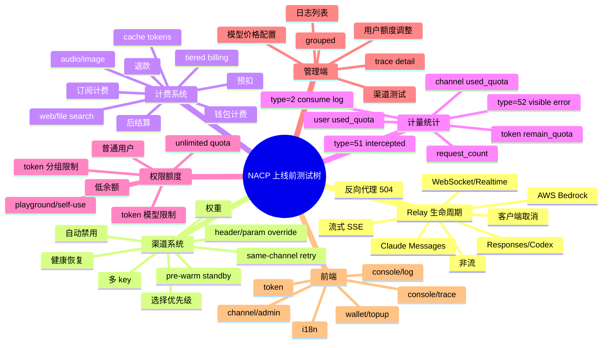

# NACP 测试执行计划

> 目的：把 `test-newapi-v0-13-2-regression-plan.md` 落成下一步可直接执行、分工、记录结果的测试方案。
> 基线：NewAPI `v0.13.2`，commit `bee339d279ccecbf8c8a89e14ddbbd902f78bd5d`
> 当前目标：NACP classic-plus-0.2.0-dev
> 测试环境：在线服务器 `143.198.87.200` / `https://nacp.m.srl`
> 日期：2026-05-15

## 1. 测试目标

本轮测试要证明三件事：

1. NACP 新增的智能重试、渠道健康、探测、错误日志拆分、日志分组、请求链路视图能在在线服务器和真实上游渠道上按设计正常工作。
2. 这些修改不破坏 NewAPI v0.13.2 原有模块，尤其是 relay、计费、计量、统计、渠道、用户、令牌、权限、日志、任务类接口。
3. 新增查询和迁移在 SQLite、MySQL、PostgreSQL 三种数据库下都兼容，且在大日志量下性能可控。

## 2. 测试分层

| 层级 | 目的 | 必跑程度 |
|---|---|---|
| L0 静态检查 | 发现无关文件、直接 JSON 调用、重复实现、保护标识改动 | 必跑 |
| L1 单元/属性测试 | 验证纯逻辑、状态机、聚合规则、格式化 | 必跑 |
| L2 三数据库集成 | 验证迁移、SQL、保留字、分页、聚合 | 必跑 |
| L3 Relay E2E | 用 mock upstream 验证重试、探测、日志、计费 | 必跑 |
| L4 前端功能 | 验证日志页、链路页、筛选、展开、i18n | 必跑 |
| L5 原模块回归 | 验证 v0.13.2 既有能力没有回退 | 必跑 |
| L6 性能压测 | 验证 grouped/trace 和重试日志写入压力 | 发布前必跑 |
| L7 灰度观察 | 线上小流量验证真实 provider 与真实 DB | 发布前必跑 |

## 3. 进入测试前的代码清理门槛

先处理或明确这些点，否则后面的测试结果容易混杂：

| ID | 项 | 处理要求 |
|---|---|---|
| PRE-01 | `service/.DS_Store` | 不能进入提交 |
| PRE-02 | `model/trace.go` 与 `service/trace.go` 重复实现 | 明确保留一个权威实现，避免未来逻辑分叉 |
| PRE-03 | 健康状态与 channel cache 同步 | 明确 `OnUserRequestError/OnProbeResult` 后 selector 读取哪个状态源 |
| PRE-04 | `/api/log/traces?status=` 分页 total | 确认 status 过滤在分页前生效 |
| PRE-05 | provider probe 范围 | 明确哪些 provider 支持 direct probe，哪些跳过或走专用实现 |

## 4. 在线测试环境准备

### 4.1 在线服务器

| 项 | 值 |
|---|---|
| 域名 | `https://nacp.m.srl` |
| 服务器 | `143.198.87.200` |
| 应用容器 | `nacp` |
| 数据库容器 | `nacp-mysql` |
| 数据库 | MySQL / `nacp` |
| 线上测试模型（Claude） | `claude-haiku-4-5-20251001` |
| 线上测试模型（Codex） | `gpt-5.3-codex` 为首选；若真实调用失败，再按线上可用模型调整 |

### 4.2 真实测试渠道

用户提供的是渠道 key，不是账号 API token。在线测试应使用这些 key 作为 `channels.key`，通过真实上游 `https://ailink.dog` 发起请求。

| 渠道名 | key 摘要 | 类型用途 | 期望配置 |
|---|---|---|---|
| `NACP-test-CCM` | `sk-eVzyN...Q5RNsJ` | Claude 模型 | type=14, model=`claude-haiku-4-5-20251001` |
| `NACP-test-codex` | `sk-yFWB0...MuLNpj` | Codex 模型 | type=1 或按实际支持配置，model 首选 `gpt-5.3-codex` |
| `NACP-test-aws` | `sk-sq4ci...79WkQV` | Claude (AWS) | type=14, model=`claude-haiku-4-5-20251001` |
| `NACP-test-kiro` | `sk-4A2tN...XyFCjr` | Claude (Kiro) | type=14, model=`claude-haiku-4-5-20251001` |
| `NACP-test-claude` | `sk-i1Iu...hBdx` | Claude | type=14, model=`claude-haiku-4-5-20251001` |

当前已执行线上渠道变更后的状态：

| ID | 渠道 | type | group | models | priority | weight | health |
|---:|---|---:|---|---|---:|---:|---|
| 13 | `NACP-test-CCM` | 14 | default | `claude-haiku-4-5-20251001` | 50 | 60 | healthy |
| 14 | `NACP-test-aws` | 14 | default | `claude-haiku-4-5-20251001` | 50 | 40 | healthy |
| 15 | `NACP-test-kiro` | 14 | default | `claude-haiku-4-5-20251001` | 20 | 50 | healthy |
| 16 | `NACP-test-codex` | 1 | default | `gpt-5.3-codex,gpt-5.3-codex-spark,gpt-5.1-codex,gpt-5.1-codex-mini,gpt-5-codex` | 20 | 50 | healthy |
| 17 | `NACP-test-claude` | 14 | default | `claude-haiku-4-5-20251001` | 20 | 50 | healthy |

建议线上渠道目标状态：

| 名称 | 优先级 | 权重 | 用途 |
|---|---:|---:|---|
| `MOCK-Controllable-P100` | 100 | 80 | 可控故障渠道，模拟 400/401/429/5xx |
| `NACP-test-CCM` | 50 | 60 | Claude 真实 P50 |
| `NACP-test-aws` | 50 | 40 | Claude AWS 真实 P50 |
| `NACP-test-kiro` | 20 | 50 | Claude Kiro 真实 P20 |
| `NACP-test-claude` | 20 | 50 | Claude 真实 P20 |
| `NACP-test-codex` | 20 | 50 | Codex 真实渠道，单独用于 `/v1/responses`/Codex 类测试 |

### 4.2.1 固定拓扑下的测试原则

现在已经有真实渠道，测试计划需要按线上拓扑执行，而不是只用抽象 A/B/C 渠道：

| 路径 | 参与渠道 | 不参与渠道 | 原因 |
|---|---|---|---|
| Claude `/v1/chat/completions` | 12, 13, 14, 15, 17 | 16 | `NACP-test-codex` 不支持 Claude chat/completions，避免污染 Claude 重试测试 |
| Codex `/v1/responses` | 16 | 12, 13, 14, 15, 17 | Codex adaptor 只支持 responses/compact，不支持 chat/messages |
| 日志/链路查询 | 所有渠道 | 无 | 所有 request_id 都要能聚合展示 |
| 健康状态机 | 所有渠道 | 无 | 但 Codex 与 Claude 要分模型分别验证 |

固定渠道角色：

| 角色 | 渠道 ID | 渠道名 | 说明 |
|---|---:|---|---|
| Mock 入口 | 12 | `MOCK-Controllable-P100` | 最高优先级，用于制造失败并触发重试 |
| Claude P50 主真实渠道 | 13 | `NACP-test-CCM` | P50 权重 60 |
| Claude P50 副真实渠道 | 14 | `NACP-test-aws` | P50 权重 40 |
| Claude P20 兜底渠道 | 15 | `NACP-test-kiro` | 低优先级 |
| Codex 专用渠道 | 16 | `NACP-test-codex` | `/v1/responses` 专测 |
| Claude P20 兜底渠道 | 17 | `NACP-test-claude` | 低优先级 |

核心验证路径：

```text
Claude 正常路径：
12(P100 mock) -> 13/14(P50 real) -> 15/17(P20 real)

Codex 正常路径：
16(Codex real) only
```

### 4.3 线上渠道变更记录

已获得明确批准并完成以下动作：

1. 将已有 `REAL-CCM-P50`、`REAL-AWS-P50`、`REAL-Kiro-P20` 重命名为 `NACP-test-*`。
2. 新增 `NACP-test-codex` 和 `NACP-test-claude`。
3. 将 5 个测试渠道健康状态重置为 `healthy`。
4. 重启 `nacp` 容器刷新内存渠道缓存。

### 4.4 基线目录

已准备：

```bash
git -C NewAPIv0.13.2 rev-parse HEAD
git -C NewAPIv0.13.2 describe --tags --exact-match HEAD
```

预期：

```text
bee339d279ccecbf8c8a89e14ddbbd902f78bd5d
v0.13.2
```

### 4.5 数据库矩阵

| 数据库 | 用途 | 最低要求 |
|---|---|---|
| SQLite | 快速本地单库验证 | 项目默认支持 |
| MySQL | 生产主路径验证 | >= 5.7.8 |
| PostgreSQL | 跨库兼容验证 | >= 9.6 |

每个数据库都要准备两类库：

| 库类型 | 说明 |
|---|---|
| clean DB | 空库直接启动迁移 |
| upgraded DB | 从 v0.13.2 schema + 旧数据升级 |

### 4.6 Mock upstream

在线服务器已有 `MOCK-Controllable-P100`，用于制造错误码并触发真实渠道重试。mock 只用于制造故障入口，成功路径必须落到真实测试渠道。

需要 mock 至少支持：

| 能力 | 说明 |
|---|---|
| 按 channel 返回不同状态 | A/B/C 渠道分别返回 200/400/401/408/429/500/502/503/504/524 |
| 按请求次数返回序列 | 例如 A 第一次 500，第二次 200 |
| 延迟/超时 | 模拟 probe timeout、relay timeout |
| 流式响应 | 首包前失败、首包后中断 |
| 记录收到的请求 | 校验 probe body、headers、path |

## 5. 执行阶段计划

### Phase 0：静态检查

| ID | 命令/方法 | 通过标准 |
|---|---|---|
| P0-ST-01 | `git status --short` | 无无关垃圾文件；已知新增文件都能解释 |
| P0-ST-02 | `git diff --no-index --stat NewAPIv0.13.2 . -- controller service model middleware router web/src` | 差异范围符合 changelog |
| P0-ST-03 | `rg -n "json\\.(Marshal|Unmarshal|NewDecoder|NewEncoder)" controller service model relay middleware common` | 新业务逻辑不直接调用 `encoding/json` marshal/unmarshal |
| P0-ST-04 | `rg -n "new-api|QuantumNous|quantumnous" README* LICENSE go.mod web package.json .github Dockerfile*` | 保护标识没有被删除或替换 |
| P0-ST-05 | 检查 `model/trace.go`、`service/trace.go` | 不保留重复实现，或有明确注释说明 |

### Phase 1：后端单元和属性测试

先跑现有测试：

```bash
go test ./service -run 'Test(Trace|Health|Property|Default|GetHealth)'
```

建议补齐后再跑：

```bash
go test ./service ./model ./controller
go test -race ./service -run 'Test.*Health|Test.*Probe|Test.*Grouped'
```

必须新增/覆盖：

| ID | 测试文件 | 覆盖点 |
|---|---|---|
| P1-01 | `service/channel_health_test.go` | 五状态机全转换、Disabled 免疫、恢复观察期 |
| P1-02 | `model/channel_cache_health_test.go` | Degraded 过滤、exclude、fallback、权重 |
| P1-03 | `service/channel_probe_test.go` | probe body、timeout、29/59 log、request_id、quota=0 |
| P1-04 | `service/log_grouped_test.go` | 五种链路模式、筛选、分页、channel_path、total |
| P1-05 | `service/trace_test.go` | detail/list 排序、聚合、status、Other 解析 |
| P1-06 | `controller/log_trace_auth_test.go` | grouped/traces/trace 权限和参数 |

通过标准：

| 项 | 标准 |
|---|---|
| 状态机 | 所有转换符合需求，race 模式无数据竞争 |
| grouped | 无重复、无遗漏、total 正确、虚拟 20/50 不入库 |
| trace | detail 最多 100 条，按时间升序，status_code 解析稳定 |
| probe | 探测日志不影响用户额度和统计 |

### Phase 2：三数据库集成测试

每种数据库都执行同一套 fixture。

#### 2.1 迁移测试

| ID | 场景 | 断言 |
|---|---|---|
| DB-01 | clean DB 启动 | `channels` 新增 4 个 health 字段 |
| DB-02 | v0.13.2 upgraded DB 启动 | 旧数据保留，新字段默认值正确 |
| DB-03 | `SKIP_DB_MIGRATION=true` | 明确跳过迁移；缺字段场景不能误判成功 |

health 字段：

```text
health_status
health_updated_at
health_fail_count
health_success_count
```

#### 2.2 Fixture 数据

在 `logs` 表构造：

| request_id | 数据 | 预期 |
|---|---|---|
| `req_direct_success` | 1 条 type=2 | grouped 普通 type=2 |
| `req_retry_success` | 51, 51, 29, 2 | grouped 虚拟 type=20 |
| `req_retry_failed` | 51, 59, 52 | grouped 虚拟 type=50 |
| `req_direct_failed` | 52 | 按需求应为失败链路；若实现不是，记录差异 |
| `req_legacy_error` | 5 | 旧错误兼容 |
| 空 request_id | type=2/type=5 | 普通行，不进入 trace summary |

#### 2.3 API 验证

| ID | API | 参数 | 断言 |
|---|---|---|---|
| DB-API-01 | `/api/log/grouped` | 默认 | 混合列表倒序 |
| DB-API-02 | `/api/log/grouped` | `type=2` | 只返回无重试 type=2 |
| DB-API-03 | `/api/log/grouped` | `type=51` | 只返回包含 51 的摘要 |
| DB-API-04 | `/api/log/grouped` | `request_id=req_retry_success` | 平铺返回该请求所有步骤 |
| DB-API-05 | `/api/log/grouped` | `group=default` | 三库均不因 group 保留字报错 |
| DB-API-06 | `/api/log/trace` | `request_id=req_retry_success` | 返回 2/51/29，升序 |
| DB-API-07 | `/api/log/traces` | `status=success` | total 和分页正确 |
| DB-API-08 | `/api/log/traces` | `status=failed` | total 和分页正确 |

### Phase 3：在线 Relay E2E

核心目标：在 `https://nacp.m.srl` 上用真实渠道验证客户端少报错，内部日志完整，计费不重复。

### 3.1 Claude 真实渠道 E2E

| ID | mock 状态 | 预期成功渠道 | 客户端结果 | 日志断言 | 健康断言 | 计费断言 |
|---|---:|---|---|---|---|---|
| CL-01 | 200 | 12 | 200 | 1 条 type=2，channel=12 | 12 healthy | 扣费一次 |
| CL-02 | 500 | 13 或 14 | 200 | 12 的 51；13/14 的 2；可能有 29/59 probe | 12 Probing/Degraded 按阈值 | 只按最终成功扣费 |
| CL-03 | 502 | 13 或 14 | 200 | 链路摘要 type=20，channel_path 含 `12→13/14` | 12 状态变化正确 | 不重复扣费 |
| CL-04 | 503 | 13 或 14 | 200 | 51 + 2，客户端无感 | 12 状态变化正确 | 不重复扣费 |
| CL-05 | 429 | 12 或 13/14 | 200 | 同渠道重试 51 带 `retry_type=same_channel` | 不误禁用 | 不重复扣费 |
| CL-06 | 400 | 13 或 14，或最终 400 | 按实现结果 | 记录错误但 12 不因健康降级 | 12 health 不变 | 无重复扣费 |
| CL-07 | 401 无禁用关键词 | 失败或切换 | 51/52 正确 | 12 不误降级 | 退款正确 |
| CL-08 | 401 + 禁用关键词 | 切到 13/14 或最终失败 | 51/52 正确 | 12 立即 Degraded | 退款/扣费正确 |
| CL-09 | 408/504/524 | 失败或按原策略 | 不应产生健康误降级 | 12 health 不变 | 退款正确 |
| CL-10 | 手动把 13 degraded | 14 或 15/17 | 200 | channel_path 不含 13 | 13 被跳过 | 只扣最终成功 |
| CL-11 | 手动把 13/14 degraded | 15 或 17 | 200 | P50 跳过，P20 成功 | P20 兜底有效 | 只扣最终成功 |
| CL-12 | 12/13/14/15/17 全 degraded | fallback 渠道 | 200 或明确错误 | fallback warning 或 52 | 安全兜底不死锁 | 计费一致 |
| CL-13 | stream + mock 502 | 13/14 | SSE 正常 | 51 + stream type=2 | 状态正确 | 不重复 |

### 3.2 Codex 真实渠道 E2E

Codex 必须单独测 `/v1/responses`，不能混入 Claude chat/completions 重试矩阵。

| ID | 渠道 | 模型 | API | 预期 |
|---|---:|---|---|---|
| CX-01 | 16 | `gpt-5.3-codex` | `/v1/responses` | 非流式成功，type=2，channel=16 |
| CX-02 | 16 | `gpt-5.3-codex` | `/v1/responses` stream | 流式成功，日志 stream 状态正常 |
| CX-03 | 16 | `gpt-5.3-codex` | `/v1/chat/completions` | 明确失败，错误说明 endpoint unsupported，不应污染 Claude 渠道健康 |
| CX-04 | 16 | `gpt-5.3-codex` | `/v1/responses/compact` | compact 支持则成功；不支持则记录明确错误 |
| CX-05 | 16 health=degraded | `/v1/responses` | 如果只有 Codex 渠道，应验证 fallback 行为或明确无可用渠道 |

### 3.3 线上 API 查询验证

| ID | API | 验证 |
|---|---|---|
| API-01 | `/api/log/grouped` | CL-02/03/04 应出现虚拟 type=20 |
| API-02 | `/api/log/grouped?type=51` | 返回包含 mock 失败的摘要行 |
| API-03 | `/api/log/grouped?type=52` | 返回最终失败摘要行 |
| API-04 | `/api/log/trace?request_id=...` | 返回 51/29/59/2/52，按时间升序 |
| API-05 | `/api/log/traces?status=success` | 包含重试后成功链路，total 正确 |
| API-06 | `/api/log/traces?status=failed` | 包含最终失败链路，total 正确 |

Claude 在线请求模板：

```bash
curl -sS --max-time 60 https://nacp.m.srl/v1/chat/completions \
  -H "Authorization: Bearer <测试账号 API token>" \
  -H "Content-Type: application/json" \
  -d '{
    "model":"claude-haiku-4-5-20251001",
    "messages":[{"role":"user","content":"NACP online retry test"}],
    "max_tokens":5
  }'
```

Codex 在线请求模板：

```bash
curl -sS --max-time 60 https://nacp.m.srl/v1/responses \
  -H "Authorization: Bearer <测试账号 API token>" \
  -H "Content-Type: application/json" \
  -d '{
    "model":"gpt-5.3-codex",
    "input":"NACP online codex channel test"
  }'
```

每个场景结束后都查：

```sql
SELECT type, request_id, channel_id, quota, prompt_tokens, completion_tokens, other
FROM logs
WHERE request_id = ?
ORDER BY created_at ASC, id ASC;
```

同时查用户额度、token used quota、channel used quota、订阅/余额相关表。

### Phase 4：计费、计量、统计专项

| ID | 场景 | 断言 |
|---|---|---|
| B-01 | 普通模型直接成功 | 用户额度、token、channel 只结算一次 |
| B-02 | 重试后成功 | 失败尝试不扣最终费用 |
| B-03 | 全失败 | 预扣退款完整 |
| B-04 | tiered_expr 模型 | expr snapshot、tier、quota 正确 |
| B-05 | 订阅计费 | subscription pre/post consumed 不重复 |
| B-06 | 免费模型 | 不预扣，日志正常 |
| B-07 | 探测日志 | `user_id=0`、`quota=0`，不进用户账单 |
| B-08 | `/api/log/stat` | 只统计 type=2 |
| B-09 | `/api/log/self/stat` | 只统计当前用户 type=2 |
| B-10 | data export | 只有消费日志触发 `LogQuotaData` |

### Phase 5：前端测试

先跑：

```bash
cd web
bunx vitest run
bun run build
bun run i18n:lint
```

功能验证：

| ID | 页面 | 场景 | 预期 |
|---|---|---|---|
| FE-01 | `/console/log` | 管理员打开 | 请求 `/api/log/grouped` |
| FE-02 | `/console/log` | 普通用户打开 | 请求 `/api/log/self/` |
| FE-03 | 日志表 | type=20 | 显示“成功(重试)” |
| FE-04 | 日志表 | type=50 | 显示“失败(重试)” |
| FE-05 | 日志表 | type=51/52 | 标签和字段不为空 |
| FE-06 | 日志表 | channel_path | 渠道路径显示正确 |
| FE-07 | 展开摘要行 | 成功加载 | 显示树形步骤 |
| FE-08 | 展开摘要行 | trace API 失败 | loading 结束，不白屏 |
| FE-09 | 普通行展开 | type=2/type=5 | 原详情展示仍正常 |
| FE-10 | 筛选 | 时间、类型、模型、用户、token、渠道、group、request_id | 都能正常过滤 |
| FE-11 | 分页 | 10/20/50/100 | total、页码、数据不乱 |
| FE-12 | `/console/traces` | 管理员 | 页面可访问 |
| FE-13 | `/console/traces` | 普通用户 | 被 AdminRoute 拦截 |
| FE-14 | i18n | zh/en/fr/ru/ja/vi/zh-TW | 新 key 不缺失 |

建议新增前端测试：

| 文件 | 覆盖 |
|---|---|
| `TraceExpandRender.test.jsx` | loading、empty、type=51/52/2/29/59 渲染 |
| `UsageLogsTable.grouped.test.jsx` | 摘要行和普通行展开差异 |
| `useUsageLogsData.test.jsx` | admin grouped URL、user self URL |

### Phase 6：原模块回归

| 模块 | 最少验证 |
|---|---|
| 登录/权限 | 登录、退出、AdminAuth、UserAuth |
| 用户 | 创建、禁用、额度调整 |
| Token | 创建、禁用、模型限制、分组限制 |
| Channel | CRUD、启停、多 key、余额查询、测试 |
| 模型/倍率 | 模型同步、倍率、分组倍率 |
| Provider | OpenAI、Claude、Gemini、Azure、OpenAI-compatible 至少成功/失败各一例 |
| Task 类 | MJ/Suno/task 创建、查询、回调 |
| 充值/订阅 | topup、兑换码、订阅购买/消耗 |
| 日志旧接口 | `/api/log/`、`/api/log/self`、`/api/log/token` |
| Dashboard/Data | 用量、quota dates、billing usage |

### Phase 7：性能压测

| ID | 数据规模 | 接口/场景 | 目标 |
|---|---|---|---|
| PERF-01 | 1 万 logs | `/api/log/grouped` | P95 < 300ms |
| PERF-02 | 10 万 logs | grouped 多筛选 | P95 < 800ms |
| PERF-03 | 100 万 logs | grouped 默认第一页 | P95 < 2s 或有优化方案 |
| PERF-04 | 10 万 retry request_id | grouped | 不触发 DB 参数上限 |
| PERF-05 | 100 并发 relay | 重试 + prewarm | 无 goroutine 泄漏，DB 写入可控 |
| PERF-06 | 1000 degraded channels | probe loop | 不形成上游/DB 突刺 |

必须记录：

| 指标 | 说明 |
|---|---|
| grouped API P50/P95/P99 | 管理端可用性 |
| DB CPU/慢查询 | 聚合查询风险 |
| logs 写入 TPS | 51/29/59 增量压力 |
| relay P95 latency | 透明重试带来的延迟成本 |
| 客户端错误率 | 核心收益 |

## 6. 结果记录模板

每个测试项用这个模板记录：

```text
测试 ID：
执行人：
环境：SQLite / MySQL / PostgreSQL / mock upstream / staging
代码版本：
前置数据：
执行步骤：
实际结果：
预期结果：
结论：PASS / FAIL / BLOCKED
证据：日志、SQL、截图、接口响应、commit
问题链接：
备注：
```

## 7. 发布门禁

全部满足才允许进入灰度：

| 门禁 | 标准 |
|---|---|
| 静态检查 | 无垃圾文件、无保护标识违规、无重复未决实现 |
| 后端测试 | `go test ./...` 通过，P0 新增测试通过 |
| Race | 健康状态机和探测相关 race test 通过 |
| 三数据库 | migration + grouped/trace fixture 全通过 |
| Relay E2E | R-01 到 R-12 全通过 |
| 计费 | 无重复扣费、无探测计费、退款正确 |
| 前端 | vitest/build/i18n lint 通过，日志页冒烟通过 |
| 性能 | 10 万 logs 达标；100 万 logs 有明确结论 |
| 权限 | grouped/traces/trace 只有管理员可访问 |

## 8. 灰度发布观察

灰度期间至少观察 24 小时：

| 指标 | 预期 |
|---|---|
| 客户端 5xx/429 | 下降 |
| type=51 | 可见但不过量 |
| type=52 | 低于旧错误量 |
| type=29/59 | 与重试量成比例，不爆炸 |
| relay P95 latency | 小幅上升但可接受 |
| grouped API P95 | 稳定 |
| 用户额度异常 | 0 |
| 退款异常 | 0 |
| Degraded 渠道数 | 与真实上游质量一致，不大面积误判 |

## 9. 快速回滚策略

| 问题 | 回滚/缓解 |
|---|---|
| grouped API 慢 | 前端临时切回 `/api/log/` |
| 探测误判 | 临时关闭健康过滤或跳过不支持 provider |
| 日志写入压力高 | probe log 采样或只记录失败 |
| 计费异常 | 关闭增强 retry，恢复原 relay 逻辑 |
| 前端日志页异常 | 隐藏摘要展开，保留普通日志 |
| 某数据库 SQL 异常 | 对该库回退平铺查询或加 DB-specific 分支 |

## 10. 下一步建议

按这个顺序推进：

1. 确认 `MOCK-Controllable-P100` 仍可通过 `/tmp/mock_status.txt` 控制错误码。
2. 先跑 CL-01，确认 mock 200 基线成功。
3. 跑 CL-02/03/04，确认 mock 故障能透明切到 13/14 真实渠道。
4. 跑 CL-10/11，手动 degraded P50 渠道，验证 P20 兜底真实渠道。
5. 单独跑 CX-01/CX-02，确认 `NACP-test-codex` 真实可用。
6. 跑 API-01 到 API-06，验证线上链路日志和分组日志。
7. 验证线上计费、统计、用户额度不被 probe 和 intercepted errors 污染。
8. 再补 `service/log_grouped_test.go`、`service/channel_probe_test.go`、`model/channel_cache_health_test.go`，把线上发现固化到自动化测试。
9. 跑 10 万/100 万 logs 性能测试。
10. 按灰度观察指标看 24 小时。

## 11. 在线执行记录：普通用户真实 token 路径

执行时间：2026-05-15 03:46-03:49（Asia/Shanghai）

环境：`https://nacp.m.srl`，线上 MySQL，真实渠道，普通用户自行创建 token。

测试账号与 token：

| 项 | 值 |
|---|---|
| 普通用户 | `nacp_t_034652` |
| 用户 ID | `3` |
| Token 名称 | `ordinary-online-token-034652` |
| Token ID | `2` |
| Token 掩码 | `DoNw**********y351` |
| 用户测试额度 | 管理员增加 `1000000` quota |

执行路径：

1. 管理员登录后台 API。
2. 管理员创建普通用户 `nacp_t_034652`，角色为普通用户。
3. 普通用户登录。
4. 普通用户在 `/api/token/` 创建自己的 token。
5. 普通用户通过 `/api/token/:id/key` 取回 token key。
6. 使用该普通用户 token 调用线上 `/v1/chat/completions`。
7. 使用该普通用户 token 调用线上 `/v1/responses`。
8. 管理员通过 `/api/log/` 查询该普通用户日志。

结果：

| 测试项 | 请求 | 结果 | 结论 |
|---|---|---|---|
| 普通用户创建 token | `/api/token/` | success=true | PASS |
| Claude 普通用户调用 | `/v1/chat/completions`, model=`claude-haiku-4-5-20251001` | HTTP 200，返回 `NACP-ORDINARY-CLAUDE-OK` | PASS |
| Codex 普通用户调用 | `/v1/responses`, model=`gpt-5.3-codex` | HTTP 400，模型未配置价格 | BLOCKED |
| 管理员日志查询 | `/api/log/?username=nacp_t_034652` | 查询到额度增加日志、mock 失败日志、真实渠道消费日志 | PASS |
| 管理员按 request_id 查询 | `/api/log/?request_id=202605141949006645659958268d9d6beK56Shm` | 查询到同一链路 2 条记录 | PASS |

Claude 请求证据：

| 字段 | 值 |
|---|---|
| request_id | `202605141949006645659958268d9d6beK56Shm` |
| 首次渠道 | `MOCK-Controllable-P100` |
| 首次结果 | type=51，`status_code=401, Invalid token` |
| 重试渠道 | `NACP-test-CCM` |
| 最终结果 | type=2，消费成功 |
| 消费 quota | `96` |
| prompt tokens | `121` |
| completion tokens | `14` |
| 用户剩余额度 | `999904` |
| 用户已用额度 | `96` |
| token 日志条数 | `2` |

本轮发现：

| 发现 | 影响 | 后续动作 |
|---|---|---|
| 控制台 API 需要 `New-Api-User` header | 自动化脚本必须模拟前端 header，否则后台接口返回 `Unauthorized, New-Api-User header not provided` | 所有在线 API 测试脚本统一加入该 header |
| `/api/user/search` 返回的 `setting` 字段包含嵌套 JSON 字符串，命令行 `jq` 直接解析失败 | 自动化脚本不宜依赖用户搜索结果解析用户 ID | 优先从登录响应读取 user id；另行检查接口 JSON 编码是否严格合法 |
| `MOCK-Controllable-P100` 当前仍指向真实 `https://ailink.dog` 且 key 为 `mock-key` | 所谓 mock 200 实际返回 401，并触发透明重试；无法执行可控 429/500/超时矩阵 | 需要明确批准后修复 mock upstream 指向 |
| `gpt-5.3-codex` 对普通用户没有价格/倍率配置 | 普通用户无法正常进入 Codex 上游，400 发生在计费预检阶段 | 需要明确批准后补充 Codex 模型定价/倍率，或给 Codex 渠道增加已有默认倍率模型 |
| 线上未暴露 `/api/log/trace`、`/api/log/grouped` | 只能用 `/api/log/?request_id=...` 验证链路，无法验证新增 grouped/trace UI/API | 需要确认线上镜像是否包含本次日志聚合接口变更 |

当前门禁状态：

| 门禁 | 状态 |
|---|---|
| 普通用户 token 创建 | PASS |
| 普通用户 Claude 正常调用 | PASS |
| 钱包扣费与用户统计 | PASS |
| 透明重试日志 | PASS |
| 可控 mock 故障矩阵 | BLOCKED |
| 普通用户 Codex 正常调用 | BLOCKED |
| grouped/trace API 线上验证 | BLOCKED |

## 12. 正式部署后在线测试记录

执行时间：2026-05-15 04:11-04:27（Asia/Shanghai）

部署流程：

| 步骤 | 结果 |
|---|---|
| 本地提交 | commit `2593ad5`，`add request trace logging and online test plan` |
| 推送 GitHub | `main -> main` 成功 |
| GitHub Actions | `Build and Push Docker Image` run `25883024851` 成功 |
| 镜像 | `ghcr.io/al90slj23/nacp:main` |
| 镜像 digest | `sha256:e0ec768d918c8149d92f19f32c9089453ca2d8f6e29c477902f5a051933aacc4` |
| 服务器部署 | `docker pull` + `docker compose up -d` 成功 |
| 新接口验证 | `/api/log/traces`、`/api/log/grouped` 均返回 200 |

部署前本地验证：

| 验证 | 结果 |
|---|---|
| `./gogogo.sh 7` service 单测 | PASS |
| `GOCACHE=/private/tmp/nacp-gocache go build ./...` | PASS |
| `cd web && bunx vitest run` | PASS |

测试环境修正：

| 项 | 调整 |
|---|---|
| `MOCK-Controllable-P100` | `base_url` 改为 `http://172.19.0.1:18080`，由 `/tmp/mock_status.txt` 控制状态码 |
| Codex 模型倍率 | 通过 `/api/option/` 给 `gpt-5.3-codex`、`gpt-5.3-codex-spark`、`gpt-5.1-codex`、`gpt-5.1-codex-mini`、`gpt-5-codex` 增加 `ModelRatio` |
| 管理员临时设置 | 已恢复，`SelfUseModeEnabled=false`，管理员用户 setting 清空 |

本轮普通用户：

| 项 | 值 |
|---|---|
| 普通用户 | `nacp_t_deploy_042314` |
| 用户 ID | `5` |
| Token 名称 | `ordinary-online-token-042314` |
| Token ID | `4` |
| Token 掩码 | `v1x8**********BhJR` |
| 初始测试额度 | 用户 `2000000`，token `1000000` |

正式用例结果：

| 用例 | mock 状态 | request_id | 最终渠道 | HTTP | 消费 quota | prompt/completion | 结论 |
|---|---:|---|---|---:|---:|---:|---|
| Claude mock 200 基线 | 200 | `202605142023283188866368268d9d65t5hn9YA` | `MOCK-Controllable-P100` | 200 | 25 | 20 / 6 | PASS |
| Claude mock 500 透明重试 | 500 | `202605142023338150123558268d9d6zOo6CrWo` | `NACP-test-aws` | 200 | 46 | 21 / 14 | PASS |
| Claude mock 429 透明重试 | 429 | `202605142023432921470598268d9d6zpRLjHkX` | `NACP-test-CCM` | 200 | 96 | 121 / 14 | PASS |
| Codex 普通用户 `/v1/responses` | 不适用 | `20260514202351551152608268d9d62yMEEq6y` | `NACP-test-codex` | 200 | 82 | 19 / 14 | PASS |

关键核对：

| 核对项 | 结果 |
|---|---|
| 普通用户总扣费 | `249 = 25 + 46 + 96 + 82`，与用户 `used_quota=249` 一致 |
| 失败重试是否扣费 | mock 500/429 的 type=51 记录 quota 均为 `0` |
| 透明重试链路 | 500 场景链路 `12 -> 14`；429 场景链路 `12 -> 13` |
| Codex 计费路径 | `model_ratio=0.625`，`request_path=/v1/responses`，`request_conversion=["OpenAI Responses"]` |
| 管理员日志 | `/api/log/?username=nacp_t_deploy_042314` 返回 11 条记录，包括额度增加、失败尝试、最终消费 |
| trace 详情 | `/api/log/trace?request_id=...` 能返回步骤和 total quota/token |
| trace 列表 | `/api/log/traces?username=nacp_t_deploy_042314` 返回 2 条多步骤链路摘要 |
| grouped 接口 | `/api/log/grouped?request_id=...` 返回 200；带 request_id 时按明细行返回，不生成摘要行 |
| 渠道健康 | 12/13/14/15/16/17 测后均为 `healthy` |

测后渠道状态：

| 渠道 | health | used_quota | 说明 |
|---|---|---:|---|
| `MOCK-Controllable-P100` | healthy | 25 | mock 200 消费 |
| `NACP-test-CCM` | healthy | 19193 | 429 fallback 命中 |
| `NACP-test-aws` | healthy | 148 | 500 fallback 命中 |
| `NACP-test-kiro` | healthy | 0 | 本轮未命中 |
| `NACP-test-codex` | healthy | 16807 | Codex 普通用户命中 |
| `NACP-test-claude` | healthy | 0 | 本轮未命中 |

本轮剩余观察点：

| 观察点 | 处理建议 |
|---|---|
| 响应头未稳定暴露 `new-api-request-id` | 自动化脚本应从管理员日志按 username/token/time 回查 request_id，或后续增强响应头稳定性 |
| `/api/log/grouped?request_id=...` 当前返回明细行 | 如果前端期望摘要行，需要调整接口语义或前端使用 `/api/log/trace` 展开详情 |
| `/api/log/traces` 仅列多步骤/失败链路 | 当前符合“链路视图优先展示重试/异常”的实现；若要全量请求链路，需要放宽 `HAVING` 条件 |

## 13. 扩展在线回归记录

执行时间：2026-05-15 05:29-05:35（Asia/Shanghai）

目的：在核心链路通过后，扩大到故障码、超时、流式、权限、额度、前端路由和日志聚合。

测试用户与 token：

| 项 | 值 |
|---|---|
| 普通用户 | `nacp_t_ext_052951` |
| 用户 ID | `6` |
| 主 token | `ext-main-052951`，ID `5`，掩码 `mbdT**********f1Dc` |
| 限制 token | `ext-limit-codex-052951`，ID `6`，仅允许 `gpt-5.3-codex` |
| 低额度 token | `ext-low-052951`，ID `7`，额度 `1` |

扩展用例结果：

| 用例 | 预期 | 实际 | 结论 |
|---|---|---|---|
| mock 401 | 透明重试到真实 Claude 渠道 | HTTP 200，最终 `NACP-test-kiro` 成功，quota `32`；中途 `NACP-test-aws` 返回 503 memory overloaded | PASS |
| mock 403 | 透明重试到真实 Claude 渠道 | HTTP 200，最终 `NACP-test-CCM` 成功，quota `96` | PASS |
| mock 500 + stream | 流式透明重试成功 | HTTP 200，SSE 中包含 `NACP-STREAM-FALLBACK-OK`，最终 `NACP-test-CCM` 成功，quota `52` | PASS |
| Codex stream | `/v1/responses` 流式成功 | HTTP 200，SSE 中包含 `NACP-CODEX-STREAM-OK`，quota `76` | PASS |
| Codex non-stream | `/v1/responses` 非流成功 | HTTP 200，返回 `NACP-CODEX-EXT-OK`，quota `290` | PASS |
| 模型限制 token | 不允许访问 Claude 模型，不扣费 | HTTP 403，`This token has no access...`；该 token 无消费日志 | PASS |
| 低额度 token | 预扣失败，不扣费 | HTTP 403，`token quota is not enough...`；该 token 无消费日志 | PASS |
| 前端路由 | 核心页面可访问 | `/`、`/console/log`、`/console/trace`、`/console/token` 均 HTTP 200 | PASS |
| mock timeout 隔离 | 客户端超时/504 后不应继续扣费 | 客户端 61 秒收到 HTTP 504；但服务端继续执行到 95 秒后 fallback 到 `NACP-test-CCM` 成功，并扣费 `96` | FAIL |

timeout 隔离用例详情：

| 字段 | 值 |
|---|---|
| request_id | `202605142133393323707318268d9d6eOJZ8Nou` |
| 客户端结果 | HTTP 504，elapsed `61s` |
| 服务端 trace | 3 次 channel 12 timeout/error 记录后，channel 13 成功 |
| 最终消费 | quota `96`，prompt `121`，completion `14` |
| 风险 | 客户端已经收到失败，但服务端仍完成上游请求并扣费，可能造成“用户认为失败但余额减少”的一致性问题 |
| 建议 | relay 应感知 client context cancellation / gateway timeout，超时返回后停止后续 retry 或避免 post-consume；至少要把这类 late success 标为不可扣费或可退款 |

扩展测试后渠道状态：

| 渠道 | health | used_quota | 说明 |
|---|---|---:|---|
| `MOCK-Controllable-P100` | healthy | 50 | mock 200 与 timeout 异步成功累计 |
| `NACP-test-CCM` | healthy | 19437 | 403、stream、timeout fallback 命中 |
| `NACP-test-aws` | healthy | 148 | 多次返回上游 503 memory overloaded，未最终消费 |
| `NACP-test-kiro` | healthy | 32 | 401 fallback 最终命中 |
| `NACP-test-codex` | healthy | 17173 | stream 与 non-stream Codex 命中 |
| `NACP-test-claude` | healthy | 0 | 本轮未命中 |

扩展回归结论：

| 模块 | 结论 |
|---|---|
| 普通请求透明重试 | PASS |
| 流式透明重试 | PASS |
| Codex Responses 普通用户 | PASS |
| token 模型限制 | PASS |
| token 低额度预扣 | PASS |
| trace/grouped 查询 | PASS |
| 前端路由可访问性 | PASS |
| timeout 后继续执行与扣费 | FAIL，需要修复 |

## 14. timeout late-success 修复与上线前增强测试计划

更新时间：2026-05-15（Asia/Shanghai）

本节用于接续第 13 节的 FAIL 项，把“线上超时后服务端继续 retry 并扣费”纳入发布门禁。该问题不只是单点 bug，它会同时影响 relay 生命周期、透明重试、预扣/后结算、用户余额、token 余额、渠道统计、消费日志、trace/grouped 日志和管理员对账。

### 14.1 修复目标

| 目标 | 验收口径 |
|---|---|
| 上游请求继承客户端 context | 客户端断开、反向代理 504、浏览器取消请求后，正在进行的上游 HTTP/AWS/WebSocket dial 必须尽快取消 |
| request context 已取消后停止 retry | 不再继续同渠道 retry，不再等待/尝试 pre-warmed standby channel，不再切换到真实渠道完成 late success |
| context 已取消后禁止结算 | `PostTextConsumeQuota`、`PostAudioConsumeQuota`、`PostWssConsumeQuota`、`SettleBilling` 不得更新用户余额、token 余额、用户 used_quota、渠道 used_quota 或消费日志 |
| 预扣必须退款 | 如果请求在预扣之后因 client context canceled 结束，`BillingSession.Refund` 必须执行，余额和 token quota 回到请求前 |
| 日志可解释 | 管理员日志中允许存在 client closed / 499 类错误记录，但不得存在同 request_id 的 type=2 消费成功记录 |

### 14.2 已加入代码级防护点

| 位置 | 防护 |
|---|---|
| `relay/channel/api_request.go` | `DoApiRequest`、`DoFormRequest`、`DoTaskApiRequest` 使用 `http.NewRequestWithContext(c.Request.Context(), ...)`；`DoWssRequest` 使用 `DialContext`；`doRequest` 在请求前和失败后检查 context |
| `relay/channel/aws/relay-aws.go` | AWS Bedrock `InvokeModel` / `InvokeModelWithResponseStream` 的 context 改为从 `c.Request.Context()` 派生，再叠加 `RelayTimeout` |
| `controller/relay.go` | 主 retry、same-channel retry、pre-warm standby retry 前后检查 context；取消后设置 499 skip-retry 错误并走退款 defer |
| `service/text_quota.go` | 文本/Claude/Codex 计费入口在 context canceled 时直接跳过结算和消费日志 |
| `service/quota.go` | audio 与 realtime/WSS 计费入口在 context canceled 时跳过结算和消费日志 |
| `service/billing.go` | `SettleBilling` 兜底拒绝 canceled context 下的任何后结算 |
| `service/request_context.go` | 统一生成 `client request closed` / status `499` / `skipRetry` 错误 |

### 14.3 本地回归门禁

| 编号 | 命令 | 必须结果 |
|---|---|---|
| L-CTX-01 | `GOCACHE=/private/tmp/nacp-go-build go test ./relay/channel ./service ./controller` | PASS |
| L-CTX-02 | `GOCACHE=/private/tmp/nacp-go-build go test ./...` | PASS；若有历史 flaky/环境依赖，必须列出包名和原因 |
| L-CTX-03 | `GOCACHE=/private/tmp/nacp-go-build go test ./relay/channel -run TestDoRequestStopsWhenClientContextCanceled -count=1` | PASS，确认 canceled context 被转换为 499 skip-retry |
| L-CTX-04 | `go test` 后 `git diff --check` | PASS，无格式/空白问题 |
| L-CTX-05 | `go build ./...` | PASS，确认所有 provider adaptor 编译通过 |

### 14.4 线上 P0 验收矩阵

| 编号 | 场景 | 操作 | 预期用户侧 | 预期管理员侧 | 预期计费/统计 |
|---|---|---|---|---|---|
| O-CTX-01 | mock timeout，客户端等待超过网关超时 | mock 置 timeout；普通用户 token 调 Claude 非流 | 客户端收到 504 或连接关闭 | trace 不得出现 timeout 后的真实渠道成功消费 | 用户余额、token 余额、used_quota、渠道 used_quota 均不增加；预扣已退款 |
| O-CTX-02 | mock timeout，客户端主动 10 秒取消 | `curl --max-time 10` 调 Claude 非流 | curl 超时退出 | 10 秒后服务端不应继续到 standby 成功 | 无 type=2 消费日志；无 late success 扣费 |
| O-CTX-03 | mock timeout，Claude stream 主动取消 | `curl --max-time 10 -N` 调 `/v1/chat/completions stream=true` | SSE 中断 | 不继续 fallback 到真实渠道后结算 | 无消费日志或 quota=0 错误日志；预扣退款 |
| O-CTX-04 | Codex stream 主动取消 | `curl --max-time 10 -N` 调 `/v1/responses stream=true` | SSE 中断 | 不出现 Codex late consume | token/user/channel 统计不增加 |
| O-CTX-05 | AWS fallback 请求取消 | 让 mock 500 后优先命中 AWS，并在 AWS 请求期间客户端取消 | 客户端取消 | AWS SDK context 取消，不再等完整响应 | 不因 AWS late response 结算 |
| O-CTX-06 | pre-warm 正在 probe 时客户端取消 | mock 500；开启 pre-warm；客户端短超时取消 | 客户端取消 | 主请求不等待 pre-warm 完成后继续 standby | 无真实渠道成功消费 |
| O-CTX-07 | 正常慢请求未取消 | mock 延迟小于网关/客户端超时 | HTTP 200 | 正常 type=2 消费日志 | 正常扣费，不能误判为取消 |
| O-CTX-08 | 正常透明重试 | mock 429/500，不取消客户端 | HTTP 200 fallback 成功 | type=51 quota=0 + type=2 最终消费 | 总扣费等于最终成功渠道 quota |

### 14.5 上线前全量增强测试树



### 14.6 上线前必测表

| 模块 | 测试点 | 核对依据 |
|---|---|---|
| 用户/token | 新建普通用户、新建 token、取 key、禁用 token、删除 token | API 返回、DB token 状态、普通用户不能越权 |
| 模型权限 | token 仅允许 Codex 时调用 Claude；仅允许 Claude 时调用 Codex | HTTP 403，无消费日志，无余额变化 |
| 钱包计费 | 非流、流式、Responses、Claude、AWS 成功扣费 | 用户余额减少、token 余额减少、used_quota 增加、type=2 quota 一致 |
| 预扣退款 | 400/401/403/429/500/timeout/client cancel | 失败记录 quota=0；预扣完全退款 |
| 透明重试 | 401/403/429/500/502/503 组合 | type=51 记录失败渠道，最终 type=2 只出现一次 |
| 不应重试 | token 权限、额度不足、模型价格缺失、参数错误 | HTTP 4xx；不切真实渠道；不扣费 |
| 渠道健康 | 连续失败、恢复成功、自动禁用阈值 | health 状态、错误计数、auto-ban 行为符合配置 |
| 统计一致性 | 用户、token、channel、日志四账本 | `sum(type=2 quota)` 与 user/channel/token delta 对齐 |
| trace/grouped | 单步成功、多步 retry、最终失败、client cancel | trace 步骤顺序、渠道链路、total quota/token 正确 |
| 前端 | `/console/log`、`/console/trace`、`/console/token`、`/console/channel` | HTTP 200；核心表格可加载；无白屏 |
| 数据库兼容 | SQLite/MySQL/PostgreSQL migration + 关键查询 | migration 成功；日志聚合 SQL 无方言问题 |
| 并发 | 同用户 10/50 并发请求，同 token 并发扣费 | 无负余额、无重复结算、无数据竞争迹象 |
| 长连接 | SSE 客户端正常读完、中途取消、网络断开 | 正常读完才扣费；中途取消不 late consume |

### 14.7 当前发布门禁状态

| 门禁 | 状态 |
|---|---|
| 本地相关包测试 | PASS：`./relay/channel ./service ./controller` |
| 全量编译 | PASS：`GOCACHE=/private/tmp/nacp-go-build go build ./...`；Go module stat cache 写入用户目录有 sandbox warning，但命令退出码为 0 |
| 全量 `go test ./...` | FAIL：`relay/channel/claude` 3 个文件内容转换测试失败；`relay/helper` 1 个 stream scanner 测试失败；均不在本次 context/计费修改路径上，需单独归档或修复后再作为全量门禁 |
| timeout late-success 修复 | 已本地实现，待提交、构建、部署 |
| 线上 O-CTX-01/O-CTX-02 重测 | 待执行 |
| Docker 构建/GitHub Actions | 待执行 |
| 线上更大范围回归 | 待执行 |

发布结论：在 O-CTX-01/O-CTX-02 线上复测通过前，不应把本次变更视为可上线完成。

## 15. timeout late-success 修复后在线复测记录

执行时间：2026-05-15 06:17-06:36（Asia/Shanghai）

部署信息：

| 项 | 值 |
|---|---|
| 修复提交 | `5f917f2`，`fix relay cancellation billing leak` |
| GitHub Actions | `Build and Push Docker Image` run `25889159470` 成功 |
| 部署镜像 | `ghcr.io/al90slj23/nacp:main` |
| 镜像 digest | `sha256:752befb446802e5220f22f37274098793755bf9136a81ec18238b3f608180d71` |
| 部署方式 | `docker pull` + `/opt/nacp/docker compose up -d` |
| 测后状态 | `nacp` running；mock upstream 已恢复 `200`；`/api/status` 返回 `success=true` |

本轮测试用户：

| 项 | 值 |
|---|---|
| 普通用户 | `nacp_t_ctx2_062904` |
| 用户 ID | `9` |
| Token 名称 | `ctx2-cancel-062904` |
| Token ID | `9` |
| Token 掩码 | `btU2**********10np` |
| 初始测试额度 | 用户 `2000000`，token `1000000` |

修复后验收结果：

| 编号 | 场景 | 客户端结果 | 余额/统计结果 | 日志结果 | 结论 |
|---|---|---|---|---|---|
| O-CTX-02 | mock `599`，客户端 `curl --max-time 10` 主动取消 | curl exit `28`，HTTP `000`，`10.004s` | 用户 `quota/used/request_count` 保持 `2000000/0/0`；token `remain/used` 保持 `1000000/0` | 2 条失败日志：type=51 `499`、type=52 `499`；type=2 数量 `0`、消费 quota `0` | PASS |
| O-CTX-08 | mock `429`，客户端正常等待 fallback | HTTP `200`，`3.816s` | 用户从 `2000000/0/0` 到 `1999899/101/1`；token 从 `1000000/0` 到 `999899/101` | 3 条 type=51 quota=0 + 1 条 type=2 quota=101；type=52 数量 `0` | PASS |
| O-CTX-01 | mock `599`，不主动取消，等待 openresty 504 | HTTP `504`，`61.173s` | 用户保持 `1999899/101/1`；token 保持 `999899/101`，无新增扣费 | 2 条 type=51，分别为 upstream do request failed 和 `499 context canceled`；type=2 数量 `0`、type=52 数量 `0` | PASS |

关键结论：

| 风险点 | 修复后结果 |
|---|---|
| 客户端已经失败/断开后服务端继续 fallback 到真实渠道 | 未复现，110 秒窗口内没有 late success |
| 客户端失败后仍扣费 | 未复现，用户余额、token 余额、used_quota、request_count 均不变 |
| 正常成功请求被误记为 client canceled | 已修正，O-CTX-08 无 type=52 |
| 正常透明重试被误伤 | 未误伤，O-CTX-08 正常 429 -> channel 13 成功，且只最终扣费一次 |

当前发布门禁更新：

| 门禁 | 状态 |
|---|---|
| O-CTX-01 gateway 504 late-success | PASS |
| O-CTX-02 client cancel late-success | PASS |
| O-CTX-08 normal fallback regression | PASS |
| 本地相关包测试 | PASS：`GOCACHE=/private/tmp/nacp-go-build go test ./relay/channel ./service ./controller` |
| 全量编译 | PASS：`GOCACHE=/private/tmp/nacp-go-build go build ./...`（有 sandbox 下 Go module stat cache warning，退出码 0） |
| 全量 `go test ./...` | 仍有既有失败：`relay/channel/claude` 文件内容转换断言、`relay/helper` stream scanner 断言；未纳入本次修复完成条件，但上线前建议单独清理 |

发布结论：timeout late-success 扣费问题已通过线上复测；本修复可进入下一轮更大范围回归。
