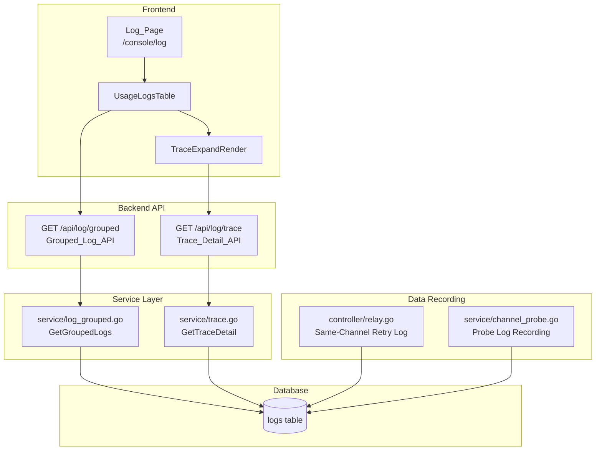
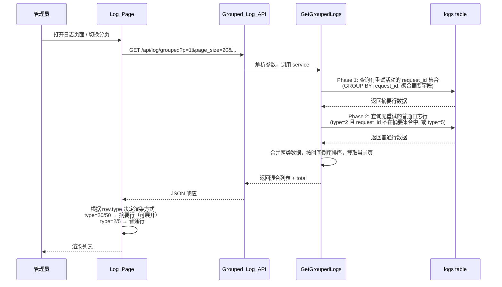
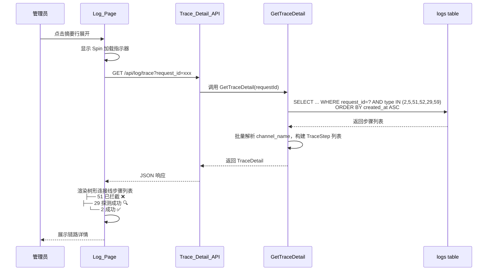

# 技术设计文档 — 日志链路分组展示 (Log Trace Grouping)

## Overview

本设计文档描述如何改进现有日志页面（`/console/log`），将平铺显示的日志按 `request_id` 分组折叠展示为链路视图。核心变更涵盖：

1. **后端修复**：在 `controller/relay.go` 的同渠道重试循环中补全 type=51 日志记录
2. **后端新增**：在 `service/channel_probe.go` 中将探测结果写入日志表（type=29/59）
3. **后端新增**：`service/log_grouped.go` 实现分组日志列表接口，返回混合数据
4. **后端扩展**：`service/trace.go` 的 `GetTraceDetail` 查询扩展支持 type=29/59
5. **前端改造**：`UsageLogsTable` 支持两种行类型（摘要行 vs 普通行）的差异化渲染和展开行为

### 设计原则

- **最小侵入**：复用现有 `Trace_Detail_API` 做展开详情加载，列表接口仅返回摘要
- **数据库兼容**：所有 SQL 使用 GORM 抽象 + 标准 SQL 函数，兼容 SQLite/MySQL/PostgreSQL
- **性能优先**：避免 N+1 查询，利用已有索引，展开详情按需加载
- **向后兼容**：不修改现有日志表结构，不新增索引，虚拟类型仅在 API 响应中出现

## Architecture

### 整体架构图



### 数据流时序图 — 列表加载



### 数据流时序图 — 行展开




## Components and Interfaces

### 组件 1：同渠道重试日志修复 (controller/relay.go)

#### 问题定位

当前 `controller/relay.go` 第 283-312 行的同渠道重试循环中，当某次重试失败时，仅更新了 `newAPIError` 和 `relayInfo.LastError`，但**没有**调用 `RecordErrorLogWithType` 记录 type=51 日志。只有在所有重试耗尽、错误最终返回给客户端时（第 380 行附近），才会记录一条 type=52 日志。

#### 修复方案

在同渠道重试循环内（第 310 行 `relayInfo.LastError = newAPIError` 之后），插入 type=51 日志记录逻辑：

```go
// controller/relay.go — 同渠道重试循环内，newAPIError != nil 分支
// 位置：约第 310 行之后

// NACP: Record intercepted error for same-channel retry (type=51)
if constant.ErrorLogEnabled && types.IsRecordErrorLog(newAPIError) {
    sameChRetryOther := map[string]interface{}{
        "retry_type":  "same_channel",
        "retry_index": retry + 1,
        "admin_info": map[string]interface{}{
            "status_code":  newAPIError.StatusCode,
            "error_type":   newAPIError.GetErrorType(),
            "error_code":   newAPIError.GetErrorCode(),
            "channel_id":   channel.Id,
            "channel_name": channel.Name,
        },
    }
    userId := c.GetInt("id")
    tokenName := c.GetString("token_name")
    modelName := c.GetString("original_model")
    tokenId := c.GetInt("token_id")
    userGroup := c.GetString("group")
    startTime := common.GetContextKeyTime(c, constant.ContextKeyRequestStartTime)
    useTimeSeconds := int(time.Since(startTime).Seconds())
    model.RecordErrorLogWithType(c, model.LogTypeErrorIntercepted, userId,
        channel.Id, modelName, tokenName,
        newAPIError.MaskSensitiveErrorWithStatusCode(),
        tokenId, useTimeSeconds,
        common.GetContextKeyBool(c, constant.ContextKeyIsStream),
        userGroup, sameChRetryOther)
}
```

#### 关键设计决策

| 决策 | 选择 | 理由 |
|------|------|------|
| 日志记录时机 | 每次失败立即记录 | 确保即使进程崩溃也不丢失中间步骤 |
| Other 字段标记 | `"retry_type": "same_channel"` | 区分同渠道重试 vs 跨渠道重试（跨渠道已有 processChannelError 记录） |
| 是否异步写入 | 同步（与现有 RecordErrorLogWithType 一致） | 同渠道重试循环本身就在主 goroutine，日志写入延迟可忽略 |

### 组件 2：探测日志记录 (service/channel_probe.go)

#### 当前状态

`recordProbeLog` 函数目前仅做 debug 日志输出，有 `// TODO` 注释表示未来写入日志表。

#### 修改方案

将 `recordProbeLog` 改为实际写入 `logs` 表，使用 `gopool.Go` 异步执行避免阻塞探测流程：

```go
// service/channel_probe.go — 替换现有 recordProbeLog 函数

// recordProbeLog records probe execution to the logs table.
// Uses gopool.Go for async write to avoid blocking the probe/retry flow.
// user_id=0, quota=0 ensures no billing impact.
func recordProbeLog(probeLog *ProbeLog, requestId string) {
    if probeLog == nil {
        return
    }
    if common.DebugEnabled {
        common.SysLog(fmt.Sprintf("NACP probe: channel=#%d model=%s success=%v latency=%dms trigger=%s",
            probeLog.ChannelID, probeLog.ModelName, probeLog.Success, probeLog.LatencyMs, probeLog.Trigger))
    }

    // Determine log type
    logType := model.LogTypeProbeSuccess // 29
    if !probeLog.Success {
        logType = model.LogTypeProbeFailed // 59
    }

    // Build Other field
    other := map[string]interface{}{
        "probe_trigger": probeLog.Trigger,
        "admin_info": map[string]interface{}{
            "status_code":  probeLog.StatusCode,
            "latency_ms":   probeLog.LatencyMs,
            "channel_name": probeLog.ChannelName,
        },
    }
    if !probeLog.Success && probeLog.Error != "" {
        other["error"] = probeLog.Error
    }
    otherStr := common.MapToJsonStr(other)

    // Use time in seconds (milliseconds / 1000, round up)
    useTimeSec := int((probeLog.LatencyMs + 999) / 1000)

    log := &model.Log{
        UserId:    0, // probe cost not billed to any user
        Username:  "",
        CreatedAt: probeLog.Timestamp,
        Type:      logType,
        Content:   fmt.Sprintf("probe %s channel #%d", probeLog.ModelName, probeLog.ChannelID),
        ModelName: probeLog.ModelName,
        Quota:     0,
        ChannelId: probeLog.ChannelID,
        UseTime:   useTimeSec,
        RequestId: requestId,
        Other:     otherStr,
    }

    gopool.Go(func() {
        if err := model.LOG_DB.Create(log).Error; err != nil {
            common.SysLog("failed to record probe log: " + err.Error())
        }
    })
}
```

#### 调用点修改

1. **ProbeNextChannels** — 传入 `requestId` 参数（从调用方 relay.go 传入）：

```go
// 函数签名变更
func ProbeNextChannels(channels []*model.Channel, modelName string, requestId string) []*ProbeResult {
    // ... 内部调用 recordProbeLog 时传入 requestId
    recordProbeLog(&ProbeLog{...}, requestId)
}
```

2. **probeDegradedChannels** — requestId 传空字符串：

```go
recordProbeLog(&ProbeLog{...}, "") // 定时探测不关联用户请求
```

3. **controller/relay.go 调用点** — 传入 requestId：

```go
// 约第 279 行
requestId := c.GetString(common.RequestIdKey)
preWarmResults = service.ProbeNextChannels(preWarmChannels, relayInfo.OriginModelName, requestId)
```


### 组件 3：分组日志列表接口 (Grouped_Log_API)

#### 路由注册

```go
// router/api-router.go — logRoute 组内新增
logRoute.GET("/grouped", middleware.AdminAuth(), controller.GetGroupedLogs)
```

#### Controller 层 (controller/log.go 新增函数)

```go
func GetGroupedLogs(c *gin.Context) {
    // 解析参数（与现有 GetAllLogs 相同的筛选参数 + 分页）
    page, _ := strconv.Atoi(c.Query("p"))
    if page < 1 { page = 1 }
    pageSize, _ := strconv.Atoi(c.Query("page_size"))
    if pageSize <= 0 { pageSize = 20 }
    if pageSize > 100 { pageSize = 100 }

    params := service.GroupedLogParams{
        Page:           page,
        PageSize:       pageSize,
        StartTimestamp: parseTimestamp(c.Query("start_timestamp")),
        EndTimestamp:   parseTimestamp(c.Query("end_timestamp")),
        LogType:        parseInt(c.Query("type")),
        ModelName:      c.Query("model_name"),
        Username:       c.Query("username"),
        TokenName:      c.Query("token_name"),
        Channel:        parseInt(c.Query("channel")),
        Group:          c.Query("group"),
        RequestId:      c.Query("request_id"),
    }

    items, total, err := service.GetGroupedLogs(params)
    if err != nil {
        c.JSON(http.StatusOK, gin.H{"success": false, "message": "查询失败"})
        return
    }

    c.JSON(http.StatusOK, gin.H{
        "success": true,
        "message": "",
        "data": gin.H{
            "page":      page,
            "page_size": pageSize,
            "total":     total,
            "items":     items,
        },
    })
}
```

#### Service 层核心设计 (service/log_grouped.go)

这是本次设计中最复杂的部分。采用**两阶段查询 + 应用层合并**策略。

##### 整体策略

```
Phase 1: 查询"有重试活动"的 request_id 摘要
  → GROUP BY request_id
  → 聚合字段：min(created_at), max(created_at), channel_path 原始数据, quota 合计等
  → 条件：request_id 下存在 type IN (51, 52, 29, 59)

Phase 2: 查询"无重试"的普通日志行
  → type IN (2, 5)
  → request_id 不在 Phase 1 结果集中（或 request_id 为空）
  → 或 type=2 且该 request_id 下无 51/52/29/59 记录

Merge: 合并两类数据，统一按 created_at DESC 排序，截取分页
```

##### 数据结构定义

```go
// service/log_grouped.go

package service

// GroupedLogParams 分组日志查询参数
type GroupedLogParams struct {
    Page           int
    PageSize       int
    StartTimestamp int64
    EndTimestamp   int64
    LogType        int    // 筛选类型：0=全部, 2=仅普通消费, 51/52=仅含该类型的摘要
    ModelName      string
    Username       string
    TokenName      string
    Channel        int
    Group          string
    RequestId      string // 非空时切换为平铺模式
}

// GroupedLogItem 统一的列表项（摘要行和普通行共用）
type GroupedLogItem struct {
    // 通用字段（两种行都有）
    Id               int    `json:"id"`
    Type             int    `json:"type"`              // 20/50=摘要, 2/5=普通
    CreatedAt        int64  `json:"created_at"`
    ModelName        string `json:"model_name"`
    Username         string `json:"username"`
    TokenName        string `json:"token_name"`
    Quota            int    `json:"quota"`
    PromptTokens     int    `json:"prompt_tokens"`
    CompletionTokens int    `json:"completion_tokens"`
    UseTime          int    `json:"use_time"`
    ChannelId        int    `json:"channel"`           // 普通行用
    ChannelName      string `json:"channel_name"`      // 普通行用
    RequestId        string `json:"request_id"`
    Group            string `json:"group"`
    Other            string `json:"other"`
    IsStream         bool   `json:"is_stream"`
    Content          string `json:"content"`

    // 摘要行专用字段（普通行为零值）
    ChannelPath      string `json:"channel_path,omitempty"`  // "12→14"
    TotalDuration    int    `json:"total_duration,omitempty"` // 秒
    StepCount        int    `json:"step_count,omitempty"`
    IsSummary        bool   `json:"is_summary"`              // 前端判断行类型
}
```

##### Phase 1：摘要行查询

```go
// traceSummaryQuery 查询有重试活动的 request_id 摘要
func traceSummaryQuery(params GroupedLogParams) *gorm.DB {
    // 子查询：找出有重试活动的 request_id
    retryRequestIds := model.LOG_DB.Table("logs").
        Select("DISTINCT request_id").
        Where("type IN (51, 52, 29, 59)").
        Where("request_id != ''")

    // 应用时间范围筛选到子查询
    if params.StartTimestamp != 0 {
        retryRequestIds = retryRequestIds.Where("created_at >= ?", params.StartTimestamp)
    }
    if params.EndTimestamp != 0 {
        retryRequestIds = retryRequestIds.Where("created_at <= ?", params.EndTimestamp)
    }

    // 主查询：对这些 request_id 做聚合
    selectSQL := `
        request_id,
        MIN(created_at) AS created_at,
        MAX(created_at) AS max_created_at,
        model_name,
        username,
        token_name,
        ` + logGroupCol + ` AS ` + logGroupCol + `,
        MAX(CASE WHEN type = 2 THEN 1 ELSE 0 END) AS has_success,
        SUM(CASE WHEN type = 2 THEN quota ELSE 0 END) AS total_quota,
        SUM(CASE WHEN type = 2 THEN prompt_tokens ELSE 0 END) AS total_prompt_tokens,
        SUM(CASE WHEN type = 2 THEN completion_tokens ELSE 0 END) AS total_completion_tokens,
        COUNT(*) AS step_count
    `

    tx := model.LOG_DB.Table("logs").
        Select(selectSQL).
        Where("type IN (2, 5, 51, 52, 29, 59)").
        Where("request_id IN (?)", retryRequestIds)

    // 应用通用筛选条件
    tx = applyCommonFilters(tx, params)

    tx = tx.Group("request_id, model_name, username, token_name, " + logGroupCol)

    return tx
}
```

##### Phase 1 补充：Channel_Path 生成

由于 `GROUP_CONCAT` 不跨数据库兼容，Channel_Path 在应用层生成：

```go
// channelPathQuery 批量查询摘要行的渠道路径原始数据
// 对每个 request_id，查询其 type IN (2, 51, 52) 的步骤的 channel_id 序列
func getChannelPaths(requestIds []string) (map[string]string, error) {
    if len(requestIds) == 0 {
        return nil, nil
    }

    type channelStep struct {
        RequestId string `gorm:"column:request_id"`
        ChannelId int    `gorm:"column:channel_id"`
        CreatedAt int64  `gorm:"column:created_at"`
    }

    var steps []channelStep
    err := model.LOG_DB.Table("logs").
        Select("request_id, channel_id, created_at").
        Where("request_id IN ?", requestIds).
        Where("type IN (2, 51, 52)"). // 不含探测记录
        Order("created_at ASC").
        Find(&steps).Error
    if err != nil {
        return nil, err
    }

    // 按 request_id 分组，生成 channel_path
    result := make(map[string]string, len(requestIds))
    grouped := make(map[string][]int)
    for _, s := range steps {
        grouped[s.RequestId] = append(grouped[s.RequestId], s.ChannelId)
    }

    for reqId, channelIds := range grouped {
        result[reqId] = buildChannelPath(channelIds)
    }

    return result, nil
}

// buildChannelPath 去除连续重复的 channel_id，以 "→" 连接
func buildChannelPath(channelIds []int) string {
    if len(channelIds) == 0 {
        return ""
    }
    deduped := []int{channelIds[0]}
    for i := 1; i < len(channelIds); i++ {
        if channelIds[i] != channelIds[i-1] {
            deduped = append(deduped, channelIds[i])
        }
    }
    parts := make([]string, len(deduped))
    for i, id := range deduped {
        parts[i] = strconv.Itoa(id)
    }
    return strings.Join(parts, "→")
}
```

##### Phase 2：普通行查询

```go
// normalLogsQuery 查询无重试活动的普通日志行
func normalLogsQuery(params GroupedLogParams, retryRequestIds []string) *gorm.DB {
    tx := model.LOG_DB.Table("logs").
        Where("type IN (2, 5)")

    // 排除已被摘要行覆盖的 request_id
    if len(retryRequestIds) > 0 {
        tx = tx.Where("(request_id NOT IN ? OR request_id = '')", retryRequestIds)
    }

    // 应用通用筛选条件
    tx = applyCommonFilters(tx, params)

    return tx
}
```

##### 合并与分页策略

```go
func GetGroupedLogs(params GroupedLogParams) ([]GroupedLogItem, int64, error) {
    // 特殊情况：指定了 request_id → 平铺模式
    if params.RequestId != "" {
        return getFlatLogsForRequestId(params)
    }

    // 特殊情况：指定了 type=2 → 仅返回普通消费行
    if params.LogType == 2 {
        return getNormalLogsOnly(params)
    }

    // 特殊情况：指定了 type=51 或 type=52 → 仅返回含该类型的摘要行
    if params.LogType == 51 || params.LogType == 52 {
        return getSummaryLogsWithType(params)
    }

    // 通用情况：两阶段查询 + 合并

    // Phase 1: 获取摘要行
    summaryTx := traceSummaryQuery(params)
    var summaryRows []traceSummaryRow
    var summaryTotal int64

    // Count
    countTx := model.LOG_DB.Table("(?) AS sub", summaryTx).Count(&summaryTotal)
    if countTx.Error != nil {
        return nil, 0, countTx.Error
    }

    // Phase 2: 获取普通行总数
    // 先拿到所有有重试活动的 request_id（用于排除）
    var retryReqIds []string
    model.LOG_DB.Table("logs").
        Select("DISTINCT request_id").
        Where("type IN (51, 52, 29, 59)").
        Where("request_id != ''").
        Pluck("request_id", &retryReqIds)

    normalTx := normalLogsQuery(params, retryReqIds)
    var normalTotal int64
    normalTx.Model(&model.Log{}).Count(&normalTotal)

    total := summaryTotal + normalTotal

    // 分页策略：使用 UNION-like 应用层合并
    // 为了正确分页，我们需要知道当前页应该包含哪些行
    // 策略：分别查询两类数据的当前页范围，然后合并排序截取
    offset := (params.Page - 1) * params.PageSize
    // 多取一些数据用于合并排序（取 pageSize 条摘要 + pageSize 条普通）
    fetchSize := params.PageSize

    summaryTx.Order("created_at DESC").Limit(offset + fetchSize).Find(&summaryRows)

    var normalLogs []*model.Log
    normalTx.Order("id DESC").Limit(offset + fetchSize).Find(&normalLogs)

    // 转换为统一格式并合并
    items := mergeAndPaginate(summaryRows, normalLogs, retryReqIds, params, offset, fetchSize)

    return items, total, nil
}
```

##### 分页正确性保证

由于混合列表需要全局按时间排序，采用**游标式合并**策略：

```go
// mergeAndPaginate 将摘要行和普通行合并，按 created_at DESC 排序，截取当前页
func mergeAndPaginate(summaries []traceSummaryRow, normals []*model.Log,
    retryReqIds []string, params GroupedLogParams, offset, limit int) []GroupedLogItem {

    // 转换摘要行
    summaryItems := make([]GroupedLogItem, 0, len(summaries))
    // ... 转换逻辑

    // 转换普通行
    normalItems := make([]GroupedLogItem, 0, len(normals))
    // ... 转换逻辑

    // 合并并按 created_at DESC 排序
    all := append(summaryItems, normalItems...)
    sort.Slice(all, func(i, j int) bool {
        return all[i].CreatedAt > all[j].CreatedAt
    })

    // 截取当前页
    if offset >= len(all) {
        return []GroupedLogItem{}
    }
    end := offset + limit
    if end > len(all) {
        end = len(all)
    }
    return all[offset:end]
}
```

> **性能优化说明**：上述策略在数据量大时可能需要多取数据。实际实现中，可以利用 `created_at` 作为游标：先查摘要行的第 N 页时间范围，再查该时间范围内的普通行，避免全量加载。对于大多数场景（日志量 < 100 万条），当前策略性能足够。

##### 筛选条件复用

```go
// applyCommonFilters 应用通用筛选条件
func applyCommonFilters(tx *gorm.DB, params GroupedLogParams) *gorm.DB {
    if params.StartTimestamp != 0 {
        tx = tx.Where("created_at >= ?", params.StartTimestamp)
    }
    if params.EndTimestamp != 0 {
        tx = tx.Where("created_at <= ?", params.EndTimestamp)
    }
    if params.ModelName != "" {
        tx = tx.Where("model_name = ?", params.ModelName)
    }
    if params.Username != "" {
        tx = tx.Where("username = ?", params.Username)
    }
    if params.TokenName != "" {
        tx = tx.Where("token_name = ?", params.TokenName)
    }
    if params.Channel != 0 {
        tx = tx.Where("channel_id = ?", params.Channel)
    }
    if params.Group != "" {
        tx = tx.Where(logGroupCol+" = ?", params.Group)
    }
    return tx
}
```


### 组件 4：Trace_Detail_API 扩展 (service/trace.go)

#### 修改内容

在 `GetTraceDetail` 函数中，将查询条件从 `type IN (2, 5, 51, 52)` 扩展为 `type IN (2, 5, 51, 52, 29, 59)`：

```go
// service/trace.go — GetTraceDetail 函数内
// 修改前：
//   Where("type IN (2, 5, 51, 52)").
// 修改后：
    Where("type IN (2, 5, 51, 52, 29, 59)").
```

同时在 `TraceStep` DTO 中新增 `Other` 字段，以便前端获取 `retry_type` 和 `probe_trigger` 标记：

```go
// service/trace.go — TraceStep 结构体
type TraceStep struct {
    Id          int    `json:"id"`
    ChannelId   int    `json:"channel_id"`
    ChannelName string `json:"channel_name"`
    Type        int    `json:"type"`
    StatusCode  *int   `json:"status_code"`
    UseTime     int    `json:"use_time"`
    ModelName   string `json:"model_name"`
    Quota       int    `json:"quota"`
    CreatedAt   int64  `json:"created_at"`
    Other       string `json:"other,omitempty"` // 新增：保留 retry_type/probe_trigger 标记
}
```

### 组件 5：新日志类型常量 (model/log.go)

```go
// model/log.go — 常量定义区域新增
const (
    // ... 现有常量保持不变 ...

    // NACP: Probe log types for pre-warm/degraded probe tracking
    LogTypeProbeSuccess = 29 // Probe request succeeded (lightweight health check)
    LogTypeProbeFailed  = 59 // Probe request failed (timeout or non-2xx)
)
```

### 组件 6：前端 UsageLogsTable 改造

#### 6.1 API 调用切换

```javascript
// web/src/pages/Log/index.jsx (或对应的日志页面组件)
// 修改 fetchLogs 函数，将 API 端点从 /api/log/ 切换为 /api/log/grouped
// 当 requestId 筛选条件非空时，仍使用 /api/log/grouped（后端自动切换平铺模式）

const fetchLogs = async () => {
  const url = '/api/log/grouped';
  const params = {
    p: activePage,
    page_size: pageSize,
    start_timestamp: startTimestamp,
    end_timestamp: endTimestamp,
    type: logType,
    model_name: modelName,
    username: username,
    token_name: tokenName,
    channel: channel,
    group: group,
    request_id: requestId,
  };
  // ... fetch logic
};
```

#### 6.2 行类型判断与差异化渲染

```jsx
// web/src/components/table/usage-logs/UsageLogsTable.jsx

// 判断是否为摘要行
const isSummaryRow = (record) => record.is_summary === true;

// 差异化展开行为
const expandRowRender = (record, index) => {
  if (isSummaryRow(record)) {
    // 摘要行：展开显示链路步骤时间线
    return <TraceExpandRender requestId={record.request_id} />;
  }
  // 普通行：保持现有 Descriptions 展开
  return <Descriptions data={expandData[record.key]} />;
};

// rowExpandable 判断
const rowExpandable = (record) => {
  if (isSummaryRow(record)) {
    return true; // 摘要行始终可展开
  }
  return expandData[record.key] && expandData[record.key].length > 0;
};
```

#### 6.3 TraceExpandRender 组件

```jsx
// web/src/components/table/usage-logs/TraceExpandRender.jsx (新建)

import React, { useState, useEffect } from 'react';
import { Spin, Tag, Empty } from '@douyinfe/semi-ui';
import { API } from '../../../helpers';

const stepConfig = {
  51: { icon: '❌', label: '已拦截', color: 'red' },
  52: { icon: '❌', label: '客户端错误', color: 'red' },
  2:  { icon: '✅', label: '成功', color: 'green' },
  21: { icon: '✅', label: '成功', color: 'green' },
  29: { icon: '🔍', label: '探测成功', color: 'blue' },
  59: { icon: '🔍', label: '探测失败', color: 'grey' },
};

const TraceExpandRender = ({ requestId }) => {
  const [loading, setLoading] = useState(true);
  const [steps, setSteps] = useState([]);

  useEffect(() => {
    const fetchDetail = async () => {
      setLoading(true);
      try {
        const res = await API.get(`/api/log/trace?request_id=${requestId}`);
        if (res.data.success) {
          setSteps(res.data.data.steps || []);
        }
      } finally {
        setLoading(false);
      }
    };
    fetchDetail();
  }, [requestId]);

  if (loading) return <Spin />;
  if (steps.length === 0) return <Empty description="无链路数据" />;

  return (
    <div style={{ padding: '8px 16px', fontFamily: 'monospace', fontSize: 13 }}>
      {steps.map((step, idx) => {
        const isLast = idx === steps.length - 1;
        const prefix = isLast ? '└── ' : '├── ';
        const cfg = stepConfig[step.type] || stepConfig[51];
        return (
          <div key={step.id} style={{ lineHeight: '28px', whiteSpace: 'nowrap' }}>
            <span style={{ color: '#999' }}>{prefix}</span>
            <span>{cfg.icon} </span>
            <Tag color={cfg.color} size="small">{cfg.label}</Tag>
            <span style={{ marginLeft: 8 }}>
              CH#{step.channel_id} {step.channel_name}
            </span>
            {step.status_code && (
              <Tag color="light-blue" size="small" style={{ marginLeft: 8 }}>
                HTTP {step.status_code}
              </Tag>
            )}
            <span style={{ marginLeft: 8, color: '#666' }}>
              {step.use_time}s
            </span>
            {step.type === 2 && step.quota > 0 && (
              <span style={{ marginLeft: 8, color: '#52c41a' }}>
                {renderQuota(step.quota)}
              </span>
            )}
          </div>
        );
      })}
    </div>
  );
};

export default TraceExpandRender;
```

#### 6.4 列渲染适配 (UsageLogsColumnDefs.jsx)

在 `renderType` 函数中新增 type=20 和 type=50 的渲染：

```jsx
// 在 renderType switch 中新增
case 20:
  return (
    <Tag color='green' shape='circle'>
      {t('成功(重试)')}
    </Tag>
  );
case 50:
  return (
    <Tag color='red' shape='circle'>
      {t('失败(重试)')}
    </Tag>
  );
```

渠道列对摘要行的渲染：

```jsx
// CHANNEL 列 render 函数中，增加对摘要行的处理
render: (text, record, index) => {
  // 摘要行：显示 Channel_Path
  if (record.is_summary && record.channel_path) {
    const ids = record.channel_path.split('→');
    return (
      <Space>
        {ids.map((id, i) => (
          <React.Fragment key={i}>
            {i > 0 && <span style={{ color: '#999' }}>→</span>}
            <Tag color={colors[parseInt(id) % colors.length]} shape='circle'>
              {id}
            </Tag>
          </React.Fragment>
        ))}
      </Space>
    );
  }
  // 普通行：保持现有逻辑
  // ...existing code...
}
```


## Data Models

### 日志表结构（无变更）

现有 `logs` 表结构完全满足需求，无需新增字段或索引：

```sql
-- 已有索引（直接复用）
idx_logs_request_id  -- 用于 GROUP BY request_id 和 WHERE request_id = ?
idx_created_at_id    -- 用于时间范围筛选和排序
idx_created_at_type  -- 用于 type 筛选
```

### 新增日志类型值

| Type 值 | 常量名 | 含义 | 存储位置 |
|---------|--------|------|---------|
| 29 | LogTypeProbeSuccess | 探测成功 | logs 表（真实记录） |
| 59 | LogTypeProbeFailed | 探测失败 | logs 表（真实记录） |
| 20 | — | 重试后成功摘要 | 仅 API 响应（虚拟） |
| 50 | — | 重试后失败摘要 | 仅 API 响应（虚拟） |
| 21 | — | 链路内成功步骤 | 仅展开视图（实际为 type=2） |

### GroupedLogItem DTO 字段映射

| 字段 | 摘要行来源 | 普通行来源 |
|------|-----------|-----------|
| id | 0（虚拟行无 ID） | log.id |
| type | 20 或 50（聚合判定） | log.type |
| created_at | MIN(created_at) | log.created_at |
| model_name | 聚合取第一条 | log.model_name |
| username | 聚合取第一条 | log.username |
| token_name | 聚合取第一条 | log.token_name |
| quota | SUM(type=2 的 quota) | log.quota |
| prompt_tokens | SUM(type=2 的 prompt_tokens) | log.prompt_tokens |
| completion_tokens | SUM(type=2 的 completion_tokens) | log.completion_tokens |
| use_time | MAX(created_at) - MIN(created_at) | log.use_time |
| channel | 0（摘要行不用） | log.channel_id |
| channel_name | ""（摘要行不用） | 从 channels 表查询 |
| channel_path | buildChannelPath 生成 | ""（普通行不用） |
| request_id | GROUP BY 的 request_id | log.request_id |
| step_count | COUNT(*) | 0 |
| is_summary | true | false |
| other | "" | log.other |
| is_stream | false | log.is_stream |
| content | "" | log.content |

### API 响应格式

#### GET /api/log/grouped 响应

```json
{
  "success": true,
  "message": "",
  "data": {
    "page": 1,
    "page_size": 20,
    "total": 156,
    "items": [
      {
        "id": 0,
        "type": 20,
        "created_at": 1715000000,
        "model_name": "gpt-4o",
        "username": "admin",
        "token_name": "default",
        "quota": 5000,
        "prompt_tokens": 100,
        "completion_tokens": 50,
        "use_time": 3,
        "channel": 0,
        "channel_name": "",
        "channel_path": "12→14",
        "request_id": "req_abc123",
        "total_duration": 3,
        "step_count": 4,
        "is_summary": true,
        "group": "default",
        "other": "",
        "is_stream": false,
        "content": ""
      },
      {
        "id": 12345,
        "type": 2,
        "created_at": 1714999990,
        "model_name": "gpt-4o-mini",
        "username": "user1",
        "token_name": "api-key-1",
        "quota": 100,
        "prompt_tokens": 50,
        "completion_tokens": 20,
        "use_time": 1,
        "channel": 5,
        "channel_name": "OpenAI-Main",
        "channel_path": "",
        "request_id": "req_def456",
        "total_duration": 0,
        "step_count": 0,
        "is_summary": false,
        "group": "default",
        "other": "{...}",
        "is_stream": true,
        "content": "..."
      }
    ]
  }
}
```

#### GET /api/log/trace 响应（扩展后）

```json
{
  "success": true,
  "message": "",
  "data": {
    "request_id": "req_abc123",
    "created_at": 1715000000,
    "model_name": "gpt-4o",
    "username": "admin",
    "token_name": "default",
    "total_quota": 5000,
    "total_prompt_tokens": 100,
    "total_completion_tokens": 50,
    "steps": [
      {
        "id": 101,
        "channel_id": 12,
        "channel_name": "OpenAI-A",
        "type": 51,
        "status_code": 429,
        "use_time": 1,
        "model_name": "gpt-4o",
        "quota": 0,
        "created_at": 1715000000,
        "other": "{\"retry_type\":\"same_channel\",\"admin_info\":{...}}"
      },
      {
        "id": 102,
        "channel_id": 14,
        "channel_name": "OpenAI-B",
        "type": 29,
        "status_code": 200,
        "use_time": 0,
        "model_name": "gpt-4o",
        "quota": 0,
        "created_at": 1715000001,
        "other": "{\"probe_trigger\":\"pre_warm\",\"admin_info\":{...}}"
      },
      {
        "id": 103,
        "channel_id": 14,
        "channel_name": "OpenAI-B",
        "type": 2,
        "status_code": 200,
        "use_time": 2,
        "model_name": "gpt-4o",
        "quota": 5000,
        "created_at": 1715000003,
        "other": "{...}"
      }
    ]
  }
}
```


## Correctness Properties

*正确性属性是一种在系统所有有效执行中都应成立的特征或行为——本质上是对系统应做什么的形式化陈述。属性是人类可读规范与机器可验证正确性保证之间的桥梁。*

### Property 1: 同渠道重试失败日志完整性

*For any* 同渠道重试场景，当某次重试请求失败时，系统应产生一条 type=51 日志，该日志的 request_id 与主请求相同，channel_id 与当前重试渠道相同，且 Other 字段包含 `"retry_type": "same_channel"` 标记。

**Validates: Requirements 1.1, 1.2, 1.3**

### Property 2: 成功重试不产生错误日志

*For any* 同渠道重试场景，当某次重试请求成功时，系统不应为该次成功的请求产生 type=51 错误日志，仅产生最终的 type=2 消费日志。

**Validates: Requirements 1.4**

### Property 3: 探测日志记录正确性

*For any* 探测执行（无论成功或失败），系统应产生一条日志，其中：type 为 29（成功）或 59（失败）取决于 HTTP 响应状态码，user_id=0，quota=0，request_id 与触发探测的用户请求相同（定时探测为空字符串），且 Other 字段包含 `"probe_trigger"` 标记。

**Validates: Requirements 2.1, 2.2, 2.3, 2.4, 2.5**

### Property 4: 日志分组分类正确性

*For any* 日志数据集，分组函数应满足：(a) 若某 request_id 下存在 type∈{51,52,29,59} 的记录，则该 request_id 被归类为摘要行；(b) 若摘要行的 request_id 下存在 type=2 的记录，则摘要类型为 20（成功），否则为 50（失败）；(c) 无重试活动的 type=2 记录作为普通行出现；(d) 混合列表按 created_at 降序排列。

**Validates: Requirements 3.1, 3.3, 3.4**

### Property 5: 摘要行聚合字段正确性

*For any* 被归类为摘要行的 request_id 组，其聚合字段应满足：total_quota = SUM(该组内 type=2 记录的 quota)，total_prompt_tokens = SUM(该组内 type=2 记录的 prompt_tokens)，total_completion_tokens = SUM(该组内 type=2 记录的 completion_tokens)，step_count = 该组内所有记录的 COUNT(*)，total_duration = MAX(created_at) - MIN(created_at)。

**Validates: Requirements 3.2**

### Property 6: Channel_Path 生成正确性

*For any* 按 created_at 升序排列的日志步骤序列（仅含 type∈{2,51,52}），Channel_Path 函数应产生一个字符串，该字符串由去除连续重复后的 channel_id 以 "→" 连接而成，且仅包含数字和 "→" 字符。

**Validates: Requirements 4.1, 4.2, 4.3**

### Property 7: 链路详情包含所有日志类型

*For any* request_id，调用 Trace_Detail_API 返回的步骤列表应包含该 request_id 下所有 type∈{2,5,51,52,29,59} 的日志记录，按 created_at 升序排列，且每条步骤的字段结构一致（包含 id、channel_id、channel_name、type、status_code、use_time、model_name、quota、created_at、other）。

**Validates: Requirements 8.1, 8.2, 8.3**

## Error Handling

### 后端错误处理

| 场景 | 处理方式 |
|------|---------|
| 同渠道重试日志写入失败 | 记录系统日志（logger.LogError），不影响重试流程继续 |
| 探测日志异步写入失败 | 记录系统日志（common.SysLog），不影响探测结果返回 |
| Grouped_Log_API 查询失败 | 返回 `{"success": false, "message": "查询失败"}`，HTTP 200 |
| Trace_Detail_API 查询失败 | 返回 `{"success": false, "message": "查询失败"}`，HTTP 200 |
| Channel_Path 生成时步骤为空 | 返回空字符串 "" |
| 分页参数越界 | 返回空列表，total 为实际总数 |
| request_id 参数过长（>64 字符） | 返回参数错误提示 |

### 前端错误处理

| 场景 | 处理方式 |
|------|---------|
| Grouped_Log_API 请求失败 | 显示错误提示 Toast，保持当前列表状态 |
| 展开摘要行时 Trace_Detail_API 失败 | 在展开区域显示错误提示，允许重试 |
| 展开后步骤列表为空 | 显示"无链路数据"空状态 |
| 未知的 type 值 | 使用灰色"未知"标签兜底渲染 |
| channel_path 为空字符串 | 渠道列显示 "-" |

### 向后兼容保障

| 风险点 | 缓解措施 |
|--------|---------|
| 旧数据无 type=51 记录 | 分组条件包含 type=52，旧的 type=5 错误日志作为普通行显示 |
| 旧数据无 type=29/59 记录 | 展开视图中不显示探测步骤（步骤列表中自然不包含） |
| 前端缓存旧 API 响应格式 | GroupedLogItem 包含所有旧字段，前端可无缝切换 |
| 现有 GET /api/log/ 接口 | 保持不变，不影响其他调用方 |

## Testing Strategy

### 属性测试 (Property-Based Testing)

使用 Go 的 `testing/quick` 或 `github.com/leanovate/gopter` 库进行属性测试，每个属性最少 100 次迭代。

**测试库选择**：`github.com/leanovate/gopter`（支持自定义生成器，社区活跃）

**属性测试配置**：
- 最少 100 次迭代
- 每个测试标注对应的设计属性
- 标签格式：`Feature: log-trace-grouping, Property {number}: {property_text}`

#### 属性测试覆盖

| Property | 测试文件 | 生成器 |
|----------|---------|--------|
| Property 4: 分组分类 | `service/log_grouped_test.go` | 生成随机日志集合（不同 request_id、type 组合） |
| Property 5: 聚合字段 | `service/log_grouped_test.go` | 生成随机 quota/tokens 值的日志组 |
| Property 6: Channel_Path | `service/log_grouped_test.go` | 生成随机 channel_id 序列 |
| Property 7: 链路详情 | `service/trace_test.go` | 生成随机 type 组合的日志记录 |

#### 属性测试示例（Property 6）

```go
// service/log_grouped_test.go
func TestBuildChannelPath_Property(t *testing.T) {
    // Feature: log-trace-grouping, Property 6: Channel_Path 生成正确性
    parameters := gopter.DefaultTestParameters()
    parameters.MinSuccessfulTests = 100

    properties := gopter.NewProperties(parameters)

    properties.Property("consecutive duplicates removed", prop.ForAll(
        func(channelIds []int) bool {
            if len(channelIds) == 0 {
                return buildChannelPath(channelIds) == ""
            }
            result := buildChannelPath(channelIds)
            parts := strings.Split(result, "→")
            // 验证无连续重复
            for i := 1; i < len(parts); i++ {
                if parts[i] == parts[i-1] {
                    return false
                }
            }
            // 验证仅包含数字和 →
            for _, ch := range result {
                if ch != '→' && (ch < '0' || ch > '9') {
                    return false
                }
            }
            return true
        },
        gen.SliceOf(gen.IntRange(1, 100)),
    ))

    properties.TestingRun(t)
}
```

### 单元测试

| 测试目标 | 测试文件 | 测试内容 |
|---------|---------|---------|
| buildChannelPath | `service/log_grouped_test.go` | 空输入、单渠道、多渠道、全重复 |
| 摘要行 type 判定 | `service/log_grouped_test.go` | 有 type=2 → 20，无 type=2 → 50 |
| 筛选条件传递 | `service/log_grouped_test.go` | 各筛选参数正确应用到查询 |
| Trace_Detail_API 新类型 | `service/trace_test.go` | 包含 type=29/59 的步骤正确返回 |
| renderType 新类型 | 前端单元测试 | type=20/50 渲染正确标签 |

### 集成测试

| 测试场景 | 验证内容 |
|---------|---------|
| 完整重试链路 | 触发同渠道重试 → 验证 type=51 日志 → 调用 grouped API → 验证摘要行 |
| 探测日志记录 | 触发预热探测 → 验证 type=29/59 日志 → 展开摘要行 → 验证探测步骤可见 |
| 分页正确性 | 插入混合数据 → 逐页查询 → 验证总数一致、无遗漏无重复 |
| 筛选兼容性 | 各筛选条件组合 → 验证结果正确 |
| 三数据库兼容 | SQLite/MySQL/PostgreSQL 各跑一遍集成测试 |

