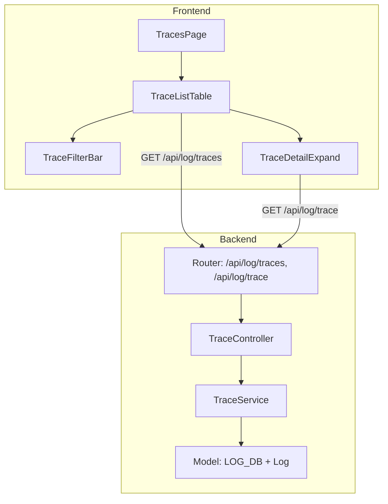
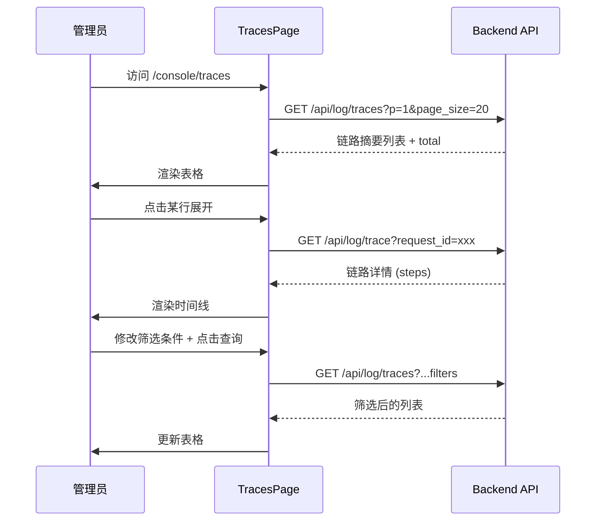

# 技术设计文档 — 请求链路视图 (Request Trace View)

## Overview

本设计为 NACP v0.2.0 新增"请求链路"功能，按 `request_id` 分组聚合日志，展示每次 API 请求的完整重试链路。该功能复用现有 `logs` 表和 `idx_logs_request_id` 索引，无需新增表或索引。

**核心价值**：管理员可快速定位请求的重试路径、失败渠道和最终结果，评估重试带来的成本影响。

**设计决策**：
- 不新增数据库表/索引，完全基于现有 Log 表的 `request_id` 字段聚合
- 后端采用两阶段查询：先 GROUP BY 获取摘要列表，再按 request_id 查详情
- 前端采用表格 + 行内展开模式，避免页面跳转

## Architecture



**层次关系**：
- Router → Controller → Service → Model（遵循项目现有架构）
- 新增文件：`controller/trace.go`、`service/trace.go`（或 `model/trace.go`）
- 前端新增：`web/src/pages/Trace/index.jsx`

## Components and Interfaces

### 后端 API 设计

#### 1. 链路列表接口 — `GET /api/log/traces`

**权限**：AdminAuth 中间件

**请求参数**（Query String）：

| 参数 | 类型 | 必填 | 说明 |
|------|------|------|------|
| p | int | 否 | 页码，默认 1，最小 1 |
| page_size | int | 否 | 每页条数，默认 20，范围 1-100 |
| start_timestamp | int64 | 否 | 起始时间（Unix 秒） |
| end_timestamp | int64 | 否 | 结束时间（Unix 秒） |
| model_name | string | 否 | 模型名称（精确匹配） |
| username | string | 否 | 用户名（精确匹配） |
| status | string | 否 | 最终结果筛选：`success` 或 `failed` |

**响应**：

```json
{
  "success": true,
  "message": "",
  "data": {
    "page": 1,
    "page_size": 20,
    "total": 150,
    "items": [
      {
        "request_id": "req_abc123",
        "created_at": 1700000000,
        "model_name": "gpt-4",
        "username": "user1",
        "token_name": "my-token",
        "status": "success",
        "channel_count": 3,
        "total_duration": 5,
        "total_quota": 15000,
        "total_prompt_tokens": 100,
        "total_completion_tokens": 200
      }
    ]
  }
}
```

**字段说明**：
- `created_at`：该 request_id 下最小的 CreatedAt（最早请求时间）
- `status`：`"success"` 表示存在 type=2 的日志，`"failed"` 表示不存在
- `channel_count`：该 request_id 下不同 ChannelId 的去重计数
- `total_duration`：最大 CreatedAt - 最小 CreatedAt（秒）
- `total_quota`：所有 type=2 日志的 Quota 之和
- `total_prompt_tokens`：所有 type=2 日志的 PromptTokens 之和
- `total_completion_tokens`：所有 type=2 日志的 CompletionTokens 之和

#### 2. 链路详情接口 — `GET /api/log/trace`

**权限**：AdminAuth 中间件

**请求参数**（Query String）：

| 参数 | 类型 | 必填 | 说明 |
|------|------|------|------|
| request_id | string | 是 | 请求 ID，最大长度 64 字符 |

**响应**：

```json
{
  "success": true,
  "message": "",
  "data": {
    "request_id": "req_abc123",
    "created_at": 1700000000,
    "model_name": "gpt-4",
    "username": "user1",
    "token_name": "my-token",
    "total_quota": 15000,
    "total_prompt_tokens": 100,
    "total_completion_tokens": 200,
    "steps": [
      {
        "id": 1001,
        "channel_id": 5,
        "channel_name": "openai-1",
        "type": 51,
        "status_code": 429,
        "use_time": 2,
        "model_name": "gpt-4",
        "quota": 0,
        "created_at": 1700000000
      },
      {
        "id": 1002,
        "channel_id": 8,
        "channel_name": "openai-2",
        "type": 2,
        "status_code": 200,
        "use_time": 3,
        "model_name": "gpt-4",
        "quota": 15000,
        "created_at": 1700000002
      }
    ]
  }
}
```

**字段说明**：
- `steps`：按 CreatedAt 升序排列的链路步骤列表，最多 100 条
- `status_code`：从 Log.Other JSON 的 `admin_info.status_code` 解析，若不存在则为 `null`
- `use_time`：UseTime 字段值（秒）
- `quota`：该步骤的 Quota 值（仅 type=2 时有意义）

**错误响应**：
- 缺少 request_id：HTTP 200，`{"success": false, "message": "request_id 参数不能为空"}`
- request_id 不存在：HTTP 200，`{"success": true, "data": {"request_id": "...", "steps": [], ...}}`

### 后端组件结构

#### controller/trace.go

```go
// GetTraceList 处理 GET /api/log/traces
// 解析分页和筛选参数，调用 service 层获取链路摘要列表
func GetTraceList(c *gin.Context) { ... }

// GetTraceDetail 处理 GET /api/log/trace
// 解析 request_id 参数，调用 service 层获取链路详情
func GetTraceDetail(c *gin.Context) { ... }
```

#### service/trace.go（或 model/trace.go）

```go
// TraceSummary 链路摘要 DTO
type TraceSummary struct {
    RequestId           string `json:"request_id"`
    CreatedAt           int64  `json:"created_at"`
    ModelName           string `json:"model_name"`
    Username            string `json:"username"`
    TokenName           string `json:"token_name"`
    Status              string `json:"status"`
    ChannelCount        int    `json:"channel_count"`
    TotalDuration       int64  `json:"total_duration"`
    TotalQuota          int    `json:"total_quota"`
    TotalPromptTokens   int    `json:"total_prompt_tokens"`
    TotalCompletionTokens int  `json:"total_completion_tokens"`
}

// TraceStep 链路步骤 DTO
type TraceStep struct {
    Id          int    `json:"id"`
    ChannelId   int    `json:"channel_id"`
    ChannelName string `json:"channel_name"`
    Type        int    `json:"type"`
    StatusCode  *int   `json:"status_code"`
    UseTime     int    `json:"use_time"`
    ModelName   string `json:"model_name"`
    Quota       int    `json:"quota"`
    CreatedAt   int64  `json:"created_at"`
}

// TraceDetail 链路详情 DTO
type TraceDetail struct {
    RequestId             string      `json:"request_id"`
    CreatedAt             int64       `json:"created_at"`
    ModelName             string      `json:"model_name"`
    Username              string      `json:"username"`
    TokenName             string      `json:"token_name"`
    TotalQuota            int         `json:"total_quota"`
    TotalPromptTokens     int         `json:"total_prompt_tokens"`
    TotalCompletionTokens int         `json:"total_completion_tokens"`
    Steps                 []TraceStep `json:"steps"`
}

// GetTraceList 查询链路摘要列表
func GetTraceList(params TraceListParams) ([]TraceSummary, int64, error) { ... }

// GetTraceDetail 查询单条链路详情
func GetTraceDetail(requestId string) (*TraceDetail, error) { ... }
```

### 后端核心查询逻辑

#### 链路列表聚合查询

```sql
SELECT
    request_id,
    MIN(created_at) AS created_at,
    MAX(created_at) AS max_created_at,
    model_name,
    username,
    token_name,
    COUNT(DISTINCT channel_id) AS channel_count,
    MAX(CASE WHEN type = 2 THEN 1 ELSE 0 END) AS has_success,
    SUM(CASE WHEN type = 2 THEN quota ELSE 0 END) AS total_quota,
    SUM(CASE WHEN type = 2 THEN prompt_tokens ELSE 0 END) AS total_prompt_tokens,
    SUM(CASE WHEN type = 2 THEN completion_tokens ELSE 0 END) AS total_completion_tokens,
    COUNT(*) AS log_count,
    MAX(CASE WHEN type IN (5, 51, 52) THEN 1 ELSE 0 END) AS has_error
FROM logs
WHERE type IN (2, 5, 51, 52)
  AND request_id != ''
  [AND created_at >= ?]
  [AND created_at <= ?]
  [AND model_name = ?]
  [AND username = ?]
GROUP BY request_id, model_name, username, token_name
HAVING log_count >= 2 OR has_error = 1
ORDER BY created_at DESC
LIMIT ? OFFSET ?
```

**关键设计决策**：
1. **GROUP BY 列选择**：`request_id, model_name, username, token_name` — 同一 request_id 下这些字段相同（同一请求的重试不会改变用户/模型/Token）
2. **HAVING 过滤**：仅返回有重试（log_count >= 2）或有错误日志的链路，过滤无重试的正常请求
3. **status 筛选**：在应用层根据 `has_success` 字段过滤，或在 HAVING 子句中添加条件
4. **不使用 `group` 列**：避免 SQL 保留字问题；如需引用 group 列，使用 `logGroupCol` 变量
5. **total 计数**：使用子查询或两次查询获取符合条件的总数

#### 链路详情查询

```sql
SELECT id, channel_id, type, use_time, model_name, quota, created_at, other
FROM logs
WHERE request_id = ?
  AND type IN (2, 5, 51, 52)
ORDER BY created_at ASC
LIMIT 100
```

查询后在应用层：
1. 从 `Other` 字段 JSON 解析 `admin_info.status_code`
2. 批量查询 channel 名称（复用现有 `CacheGetChannel` 或 DB 查询模式）
3. 聚合摘要信息（总 quota、总 tokens）

### 路由注册

在 `router/api-router.go` 的 `logRoute` 组中添加：

```go
logRoute.GET("/traces", middleware.AdminAuth(), controller.GetTraceList)
logRoute.GET("/trace", middleware.AdminAuth(), controller.GetTraceDetail)
```

### 前端组件结构

```
web/src/pages/Trace/
└── index.jsx          # TracesPage 主页面组件
```

#### TracesPage 组件职责

| 区域 | 组件/功能 | 说明 |
|------|-----------|------|
| 筛选栏 | DatePicker (dateTimeRange) + Input × 2 + Button × 2 | 时间范围、模型名称、用户名筛选 |
| 数据表格 | Semi Table | 展示链路摘要列表 |
| 行展开 | Table expandedRowRender | 内联展开链路详情时间线 |
| 分页 | Table pagination | 默认 20 条/页，可选 10/20/50/100 |
| 状态标签 | Semi Tag (green/red) | 成功/失败状态 |
| 加载状态 | Table loading prop | Spin 指示器 |
| 空状态 | Table empty prop | 空状态占位图 |
| 错误提示 | Semi Toast | 请求失败时弹出 |

#### 前端数据流



#### 侧边栏导航

在 `SiderBar.jsx` 的 `adminItems` 数组中添加：

```javascript
{
  text: t('请求链路'),
  itemKey: 'traces',
  to: '/traces',
  className: isAdmin() ? '' : 'tableHiddle',
}
```

在 `routerMap` 中添加：`traces: '/console/traces'`

在 `App.jsx` 中添加路由：

```jsx
<Route
  path='/console/traces'
  element={
    <AdminRoute>
      <TracesPage />
    </AdminRoute>
  }
/>
```

## Data Models

### 现有模型（无需修改）

```go
type Log struct {
    Id               int    `json:"id"`
    UserId           int    `json:"user_id"`
    CreatedAt        int64  `json:"created_at"`
    Type             int    `json:"type"`           // 2=Consume, 5=Error, 51=Intercepted, 52=ClientVisible
    Content          string `json:"content"`
    Username         string `json:"username"`
    TokenName        string `json:"token_name"`
    ModelName        string `json:"model_name"`
    Quota            int    `json:"quota"`
    PromptTokens     int    `json:"prompt_tokens"`
    CompletionTokens int    `json:"completion_tokens"`
    UseTime          int    `json:"use_time"`       // 秒
    ChannelId        int    `json:"channel"`
    ChannelName      string `json:"channel_name" gorm:"->"`  // 计算字段
    RequestId        string `json:"request_id,omitempty" gorm:"type:varchar(64);index:idx_logs_request_id"`
    Other            string `json:"other"`          // JSON 字符串，含 admin_info
}
```

### Other 字段 JSON 结构（已有）

```json
{
  "admin_info": {
    "status_code": 429,
    "channel_name": "openai-1",
    "provider_name": "OpenAI",
    ...
  }
}
```

### 新增 DTO（不涉及数据库变更）

| DTO | 用途 |
|-----|------|
| `TraceSummary` | 链路列表接口返回的单条摘要 |
| `TraceStep` | 链路详情中的单个步骤 |
| `TraceDetail` | 链路详情接口的完整返回 |
| `TraceListParams` | 链路列表查询参数 |

### 数据库兼容性要点

1. **GROUP BY**：SELECT 中的非聚合列（model_name, username, token_name）必须出现在 GROUP BY 中（PostgreSQL 严格要求）
2. **CASE WHEN**：三种数据库均支持标准 CASE WHEN 语法
3. **COUNT(DISTINCT)**：三种数据库均支持
4. **不使用 GROUP_CONCAT**：避免跨数据库兼容问题
5. **保留字 `group`**：如需引用 group 列，使用 `logGroupCol` 变量
6. **JSON 解析**：在 Go 应用层使用 `common.StrToMap()` 解析 Other 字段，不在 SQL 中使用 JSON 函数


## Correctness Properties

*属性是系统在所有有效执行中应保持为真的特征或行为——本质上是对系统应做什么的形式化陈述。属性是人类可读规格与机器可验证正确性保证之间的桥梁。*

### Property 1: 链路详情查询过滤与排序

*For any* 一组共享同一 request_id 的日志记录（类型混合包含 1/2/3/4/5/51/52），调用 GetTraceDetail 后返回的步骤列表应当：(a) 仅包含 type ∈ {2, 5, 51, 52} 的记录，(b) 按 created_at 升序排列，(c) 数量不超过 100 条。

**Validates: Requirements 1.1**

### Property 2: Other 字段 status_code 解析

*For any* Log 记录，若其 Other 字段为有效 JSON 且包含 `admin_info.status_code` 数值字段，则对应 TraceStep 的 status_code 应等于该数值；若 Other 为空字符串、无效 JSON、或不含该字段，则 status_code 应为 null。

**Validates: Requirements 1.3**

### Property 3: 链路最终结果分类

*For any* request_id 及其关联的日志集合，若集合中存在至少一条 type=2 的记录，则该链路的 status 应为 "success"；否则 status 应为 "failed"。

**Validates: Requirements 2.4, 2.5**

### Property 4: 链路列表按最早时间倒序

*For any* 链路列表查询结果，列表中相邻两条记录 items[i] 和 items[i+1] 应满足 items[i].created_at >= items[i+1].created_at（即按最早请求时间降序排列）。

**Validates: Requirements 2.1**

### Property 5: 链路摘要聚合正确性

*For any* request_id 及其关联的日志集合，聚合结果应满足：(a) channel_count 等于集合中不同 channel_id 的去重计数，(b) total_duration 等于 MAX(created_at) - MIN(created_at)，(c) created_at 等于 MIN(created_at)。

**Validates: Requirements 2.3**

### Property 6: HAVING 过滤条件

*For any* 链路列表查询结果中的每条记录，其对应的 request_id 应满足以下至少一个条件：(a) 该 request_id 下的日志总数 >= 2，或 (b) 该 request_id 下存在 type ∈ {5, 51, 52} 的错误日志。

**Validates: Requirements 2.8**

### Property 7: 筛选条件正确性

*For any* 链路列表查询结果，当提供了筛选条件时，返回的每条记录都应满足所有筛选条件：(a) 若指定了时间范围，则 created_at 在范围内，(b) 若指定了 model_name，则 model_name 精确匹配，(c) 若指定了 username，则 username 精确匹配，(d) 若指定了 status，则最终结果匹配。

**Validates: Requirements 2.6**

### Property 8: Quota 与 Token 聚合

*For any* request_id 及其关联的日志集合，链路摘要中的 total_quota 应等于集合中所有 type=2 记录的 quota 之和，total_prompt_tokens 应等于所有 type=2 记录的 prompt_tokens 之和，total_completion_tokens 应等于所有 type=2 记录的 completion_tokens 之和。当不存在 type=2 记录时，三者均为 0。

**Validates: Requirements 6.1, 6.2, 6.3**

### Property 9: Quota 金额格式化

*For any* 非负整数 quota 值，格式化后的美元金额字符串应等于 `$` + (quota × 0.000001).toFixed(6)，例如 quota=1234 应显示为 "$0.001234"。

**Validates: Requirements 6.4**

## Error Handling

| 场景 | 处理方式 |
|------|----------|
| request_id 参数缺失/为空 | 返回 `{"success": false, "message": "request_id 参数不能为空"}` |
| request_id 不存在 | 返回成功响应，steps 为空数组，聚合字段为 0 |
| 非管理员访问 | AdminAuth 中间件返回 403 |
| 分页参数无效 | 使用 GetPageQuery 默认行为（page=1, page_size=20, 上限 100） |
| Other 字段 JSON 解析失败 | status_code 设为 null，不影响其他字段 |
| 数据库查询错误 | 返回 `{"success": false, "message": "查询失败"}` + 服务端日志记录 |
| 渠道名称查询失败 | channel_name 设为空字符串，不阻断主流程 |

## Testing Strategy

### 属性测试 (Property-Based Testing)

**库选择**：Go 后端使用 `pgregory.net/rapid`（Go PBT 库），前端格式化函数使用 `fast-check`。

**配置**：每个属性测试最少运行 100 次迭代。

**后端属性测试覆盖**：
- Property 1-8：在 `service/trace_test.go` 中实现
- 使用内存 SQLite 数据库作为测试数据库
- 生成器：随机生成 Log 记录集合（随机 request_id、type、channel_id、created_at、Other JSON）
- 每个测试标注：`// Feature: request-trace-view, Property N: <property_text>`

**前端属性测试覆盖**：
- Property 9：在 `web/src/pages/Trace/__tests__/format.test.js` 中实现
- 使用 fast-check 生成随机非负整数，验证格式化输出

### 单元测试 (Example-Based)

| 测试场景 | 类型 |
|----------|------|
| request_id 不存在返回空 | Example |
| 非管理员访问被拒绝 | Example |
| 空 request_id 参数返回错误 | Edge Case |
| Other 字段为空字符串时 status_code 为 null | Edge Case |
| Other 字段为非法 JSON 时 status_code 为 null | Edge Case |
| 单条日志的链路不出现在列表中（除非有错误） | Edge Case |
| 前端 Tag 组件颜色映射 | Example |
| 前端展开/收起交互 | Example |

### 集成测试

| 测试场景 | 说明 |
|----------|------|
| 完整 API 调用链路 | 插入测试数据 → 调用 API → 验证响应 |
| 三种数据库兼容性 | 在 SQLite/MySQL/PostgreSQL 上分别运行聚合查询 |
| 权限中间件 | 验证 AdminAuth 正确拦截非管理员请求 |
