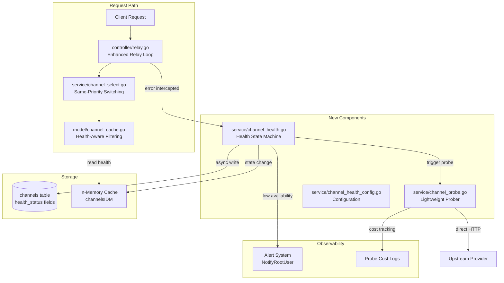
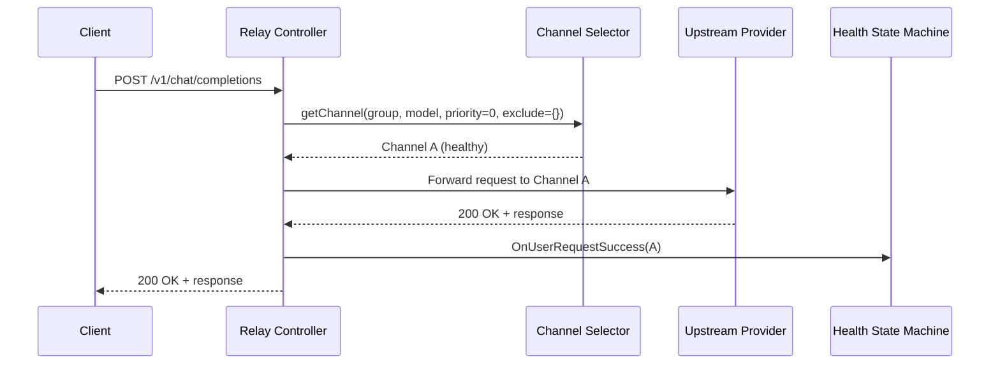
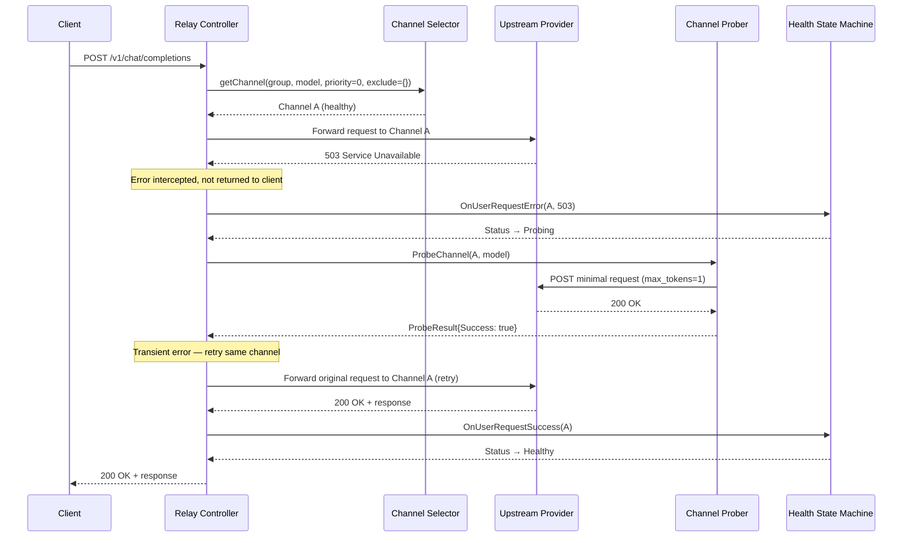
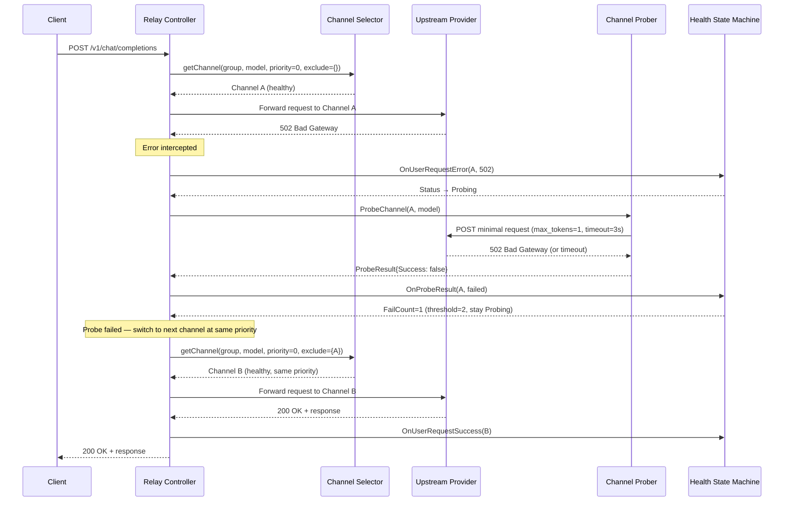
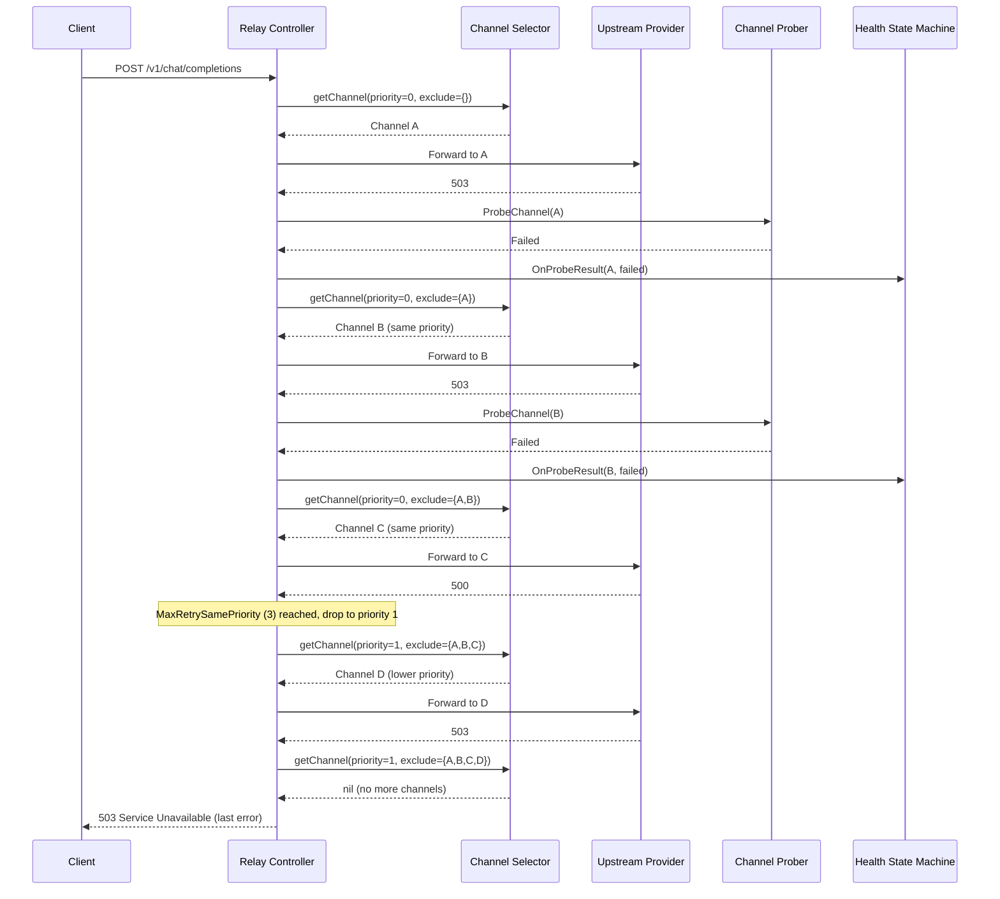
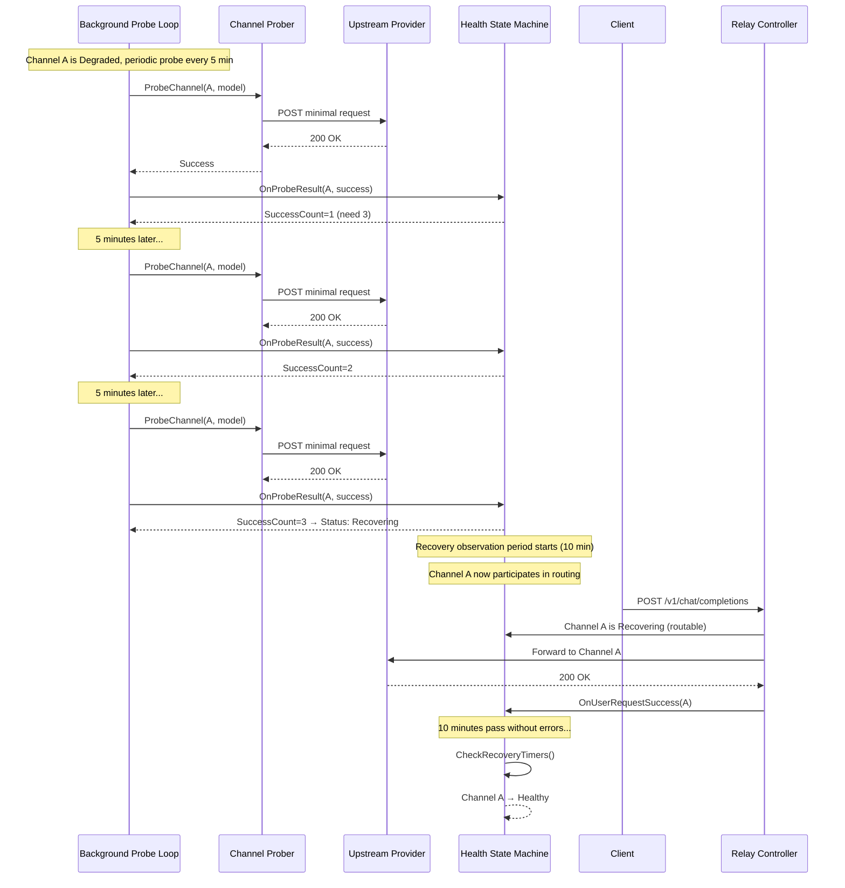

# Technical Design: Smart Relay Retry

## 1. Overview

### Architecture Summary

The Smart Relay Retry system introduces a channel health state machine that replaces the existing simple on/off channel status with a 5-state model (Healthy → Probing → Degraded → Recovering → Healthy). It intercepts upstream errors transparently, probes channels with minimal requests, and intelligently routes traffic to healthy channels — all while the client experiences only slightly higher latency instead of errors.

### Component Diagram



### Design Principles

1. **New files preferred** — Core logic in new `service/channel_health.go` and `service/channel_probe.go`
2. **Minimal existing file changes** — Only add fields to Channel struct, enhance `GetRandomSatisfiedChannel` filtering, and modify the retry loop
3. **DB + Memory cache pattern** — Same as existing `channelsIDM` cache: write to memory immediately, async write to DB
4. **All JSON via `common/json.go`** — No direct `encoding/json` calls
5. **Cross-DB compatible** — All schema changes work on SQLite, MySQL, PostgreSQL

---

## 2. Data Models

### 2.1 Health Status Type and Constants

```go
// File: service/channel_health.go (new file)

package service

// HealthStatus represents the health state of a channel
type HealthStatus string

const (
    HealthStatusHealthy          HealthStatus = "healthy"
    HealthStatusProbing          HealthStatus = "probing"
    HealthStatusDegraded         HealthStatus = "degraded"
    HealthStatusRecovering       HealthStatus = "recovering"
    HealthStatusManuallyDisabled HealthStatus = "disabled"
)

// IsRoutable returns true if the channel should participate in request routing
func (s HealthStatus) IsRoutable() bool {
    return s == HealthStatusHealthy || s == HealthStatusRecovering || s == HealthStatusProbing
}

// IsHealthy returns true if the channel is in a fully healthy state
func (s HealthStatus) IsHealthy() bool {
    return s == HealthStatusHealthy
}
```

### 2.2 New Fields on Channel Struct

```go
// File: model/channel.go — additions to Channel struct

// Health state fields (added after ChannelInfo)
HealthStatus       string `json:"health_status" gorm:"type:varchar(16);default:'healthy'"`
HealthUpdatedAt    int64  `json:"health_updated_at" gorm:"bigint;default:0"`
HealthFailCount    int    `json:"health_fail_count" gorm:"default:0"`
HealthSuccessCount int    `json:"health_success_count" gorm:"default:0"`
```

### 2.3 ProbeResult Struct

```go
// File: service/channel_probe.go (new file)

package service

import "time"

// ProbeResult holds the outcome of a single probe request
type ProbeResult struct {
    ChannelID  int
    ModelName  string
    Success    bool
    StatusCode int
    LatencyMs  int64
    Error      error
    Timestamp  time.Time
}
```

### 2.4 ProbeLog Struct (Cost Tracking)

```go
// File: service/channel_probe.go

// ProbeLog represents a probe execution record for cost tracking
type ProbeLog struct {
    ChannelID   int    `json:"channel_id"`
    ChannelName string `json:"channel_name"`
    ModelName   string `json:"model_name"`
    Success     bool   `json:"success"`
    LatencyMs   int64  `json:"latency_ms"`
    StatusCode  int    `json:"status_code"`
    Trigger     string `json:"trigger"` // "user_error", "degraded_periodic"
    Timestamp   int64  `json:"timestamp"`
}
```

### 2.5 Health Configuration Struct

```go
// File: service/channel_health_config.go (new file)

package service

import "time"

// ChannelHealthConfig holds all configurable thresholds for the health state machine
type ChannelHealthConfig struct {
    // ProbeFailThreshold: consecutive probe failures to transition Probing → Degraded
    ProbeFailThreshold int // default: 2

    // DegradedProbeInterval: how often to probe a Degraded channel
    DegradedProbeInterval time.Duration // default: 5 minutes

    // RecoverySuccessThreshold: consecutive probe successes to transition Degraded → Recovering
    RecoverySuccessThreshold int // default: 3

    // RecoveryObservationPeriod: duration without errors to transition Recovering → Healthy
    RecoveryObservationPeriod time.Duration // default: 10 minutes

    // RecoveryFailTolerance: errors allowed in Recovering before going back to Degraded
    RecoveryFailTolerance int // default: 0 (any error → back to Degraded)

    // ProbeTimeout: max time for a single probe request
    ProbeTimeout time.Duration // default: 3 seconds

    // MaxRetrySamePriority: max channels to try at the same priority level
    MaxRetrySamePriority int // default: 3

    // LowChannelWarningThreshold: emit warning when healthy channels <= this count
    LowChannelWarningThreshold int // default: 2
}

// DefaultHealthConfig returns the default configuration
func DefaultHealthConfig() *ChannelHealthConfig {
    return &ChannelHealthConfig{
        ProbeFailThreshold:         2,
        DegradedProbeInterval:      5 * time.Minute,
        RecoverySuccessThreshold:   3,
        RecoveryObservationPeriod:  10 * time.Minute,
        RecoveryFailTolerance:      0,
        ProbeTimeout:               3 * time.Second,
        MaxRetrySamePriority:       3,
        LowChannelWarningThreshold: 2,
    }
}

// globalHealthConfig is the active configuration (initially hardcoded defaults)
var globalHealthConfig = DefaultHealthConfig()

// GetHealthConfig returns the current health configuration
func GetHealthConfig() *ChannelHealthConfig {
    return globalHealthConfig
}
```

---

## 3. Database Schema Changes

### 3.1 Migration Strategy

Use GORM AutoMigrate (adding columns is safe across all 3 DBs). The new fields on the `Channel` struct with GORM tags will be auto-migrated.

### 3.2 Equivalent SQL (for reference)

**All databases (GORM handles this automatically via AutoMigrate):**

```sql
-- SQLite / MySQL / PostgreSQL — GORM AutoMigrate adds these columns
ALTER TABLE channels ADD COLUMN health_status VARCHAR(16) DEFAULT 'healthy';
ALTER TABLE channels ADD COLUMN health_updated_at BIGINT DEFAULT 0;
ALTER TABLE channels ADD COLUMN health_fail_count INT DEFAULT 0;
ALTER TABLE channels ADD COLUMN health_success_count INT DEFAULT 0;
```

### 3.3 Migration Code Pattern

No manual migration code needed. The existing `migrateDB()` in `model/main.go` already calls `DB.AutoMigrate(&Channel{})`. Adding the new fields to the `Channel` struct with proper GORM tags is sufficient — GORM's AutoMigrate will add the columns on startup.

**Verification:** GORM AutoMigrate behavior for all 3 DBs:
- **SQLite**: Uses `ALTER TABLE ... ADD COLUMN` (supported)
- **MySQL**: Uses `ALTER TABLE ... ADD COLUMN` (supported)
- **PostgreSQL**: Uses `ALTER TABLE ... ADD COLUMN` (supported)

No `ALTER COLUMN` or type changes needed — these are all new columns with defaults.

---

## 4. Component Design — New Files

### 4.1 `service/channel_health.go` — Health State Machine

**Responsibility:** Manages all health state transitions, enforces transition rules, updates memory cache + async DB writes, emits alerts.

```go
package service

import (
    "fmt"
    "sync"
    "time"

    "github.com/QuantumNous/new-api/common"
    "github.com/QuantumNous/new-api/model"
    "github.com/bytedance/gopkg/util/gopool"
)

// ─── State Transition Table ───────────────────────────────────────────────────
//
// From State        | Event                          | To State
// ─────────────────|────────────────────────────────|──────────────
// Healthy          | user request error (non-400)   | Probing
// Probing          | probe success                  | Healthy
// Probing          | probe fail count >= threshold  | Degraded
// Degraded         | consecutive probe success >= N | Recovering
// Recovering       | any request error              | Degraded
// Recovering       | observation period elapsed     | Healthy
// ManuallyDisabled | (no automatic transitions)     | —
// Any              | 401 + disable keyword          | Degraded (immediate)

// ─── Core Types ───────────────────────────────────────────────────────────────

// ChannelHealthState holds the runtime health state for a channel (in-memory)
type ChannelHealthState struct {
    mu                sync.RWMutex
    Status            HealthStatus
    FailCount         int       // consecutive failures
    SuccessCount      int       // consecutive successes
    UpdatedAt         time.Time
    RecoveryStartedAt time.Time // when Recovering state began
    LastProbeAt       time.Time // last probe execution time
}

// channelHealthStates is the in-memory map of channel ID → health state
// Protected by its own RWMutex for concurrent access
var (
    channelHealthStates   = make(map[int]*ChannelHealthState)
    channelHealthStatesMu sync.RWMutex
)

// ─── Public API ───────────────────────────────────────────────────────────────

// InitChannelHealthStates loads persisted health states from DB into memory.
// Called once at startup after InitChannelCache.
func InitChannelHealthStates()

// GetChannelHealthStatus returns the current health status for a channel.
// Thread-safe. Returns HealthStatusHealthy if channel not found in map.
func GetChannelHealthStatus(channelID int) HealthStatus

// IsChannelRoutable returns true if the channel should participate in routing.
func IsChannelRoutable(channelID int) bool

// OnUserRequestError is called when a user request to a channel fails.
// It triggers the state machine transition based on the error type.
// Returns the new health status after transition.
func OnUserRequestError(channelID int, statusCode int, errMsg string) HealthStatus

// OnUserRequestSuccess is called when a user request to a channel succeeds.
// Used to track recovery observation period for Recovering channels.
func OnUserRequestSuccess(channelID int)

// OnProbeResult is called when a probe completes.
// Drives transitions: Probing→Healthy, Probing→Degraded, Degraded→Recovering.
func OnProbeResult(channelID int, result *ProbeResult)

// ShouldProbeOnError determines if a probe should be triggered for this error.
// Returns false for 400 errors (parameter issues, not channel issues).
func ShouldProbeOnError(statusCode int) bool

// CheckRecoveryTimers is called periodically to promote Recovering channels
// that have completed their observation period without errors.
func CheckRecoveryTimers()

// ─── Internal Functions ───────────────────────────────────────────────────────

// transitionTo performs the actual state transition with proper locking.
func transitionTo(channelID int, state *ChannelHealthState, newStatus HealthStatus)

// persistHealthState asynchronously writes health state to the database.
func persistHealthState(channelID int, status HealthStatus, failCount int, successCount int)

// checkLowChannelAvailability checks if healthy channel count is critically low
// for any group+model combination and emits alerts.
func checkLowChannelAvailability(channelID int)

// emitHealthAlert sends a notification to root user about channel health changes.
func emitHealthAlert(level string, subject string, content string)
```

**Key Design Decisions:**
- Each channel has its own `sync.RWMutex` inside `ChannelHealthState` for fine-grained locking
- The global map `channelHealthStates` has a separate RWMutex for map-level operations (add/remove)
- State transitions are atomic: lock → check current state → validate transition → update → unlock
- DB writes are always async via `gopool.Go()` to avoid blocking the request path

### 4.2 `service/channel_probe.go` — Probe Execution

**Responsibility:** Executes lightweight HTTP probe requests directly to upstream providers, bypassing the full relay pipeline.

```go
package service

import (
    "context"
    "fmt"
    "net/http"
    "strings"
    "time"

    "github.com/QuantumNous/new-api/common"
    "github.com/QuantumNous/new-api/model"
    relayconstant "github.com/QuantumNous/new-api/relay/constant"
)

// ─── Probe HTTP Client ────────────────────────────────────────────────────────

// probeHTTPClient is a dedicated HTTP client for probe requests.
// Separate from the relay client to avoid interference.
var probeHTTPClient *http.Client

func initProbeHTTPClient() {
    probeHTTPClient = &http.Client{
        Timeout: GetHealthConfig().ProbeTimeout,
        Transport: &http.Transport{
            MaxIdleConns:        20,
            MaxIdleConnsPerHost: 5,
            IdleConnTimeout:     30 * time.Second,
        },
    }
}

// ─── Public API ───────────────────────────────────────────────────────────────

// ProbeChannel sends a minimal request to verify channel connectivity.
// It bypasses the full relay pipeline and makes a direct HTTP call.
//
// Parameters:
//   - channel: the channel to probe
//   - modelName: the model that triggered the error (probe uses same model)
//
// Returns:
//   - ProbeResult with success/failure, latency, and status code
func ProbeChannel(channel *model.Channel, modelName string) *ProbeResult

// ProbeChannelAsync triggers a probe in a background goroutine.
// The result is fed back to the health state machine via OnProbeResult.
func ProbeChannelAsync(channel *model.Channel, modelName string)

// StartDegradedProbeLoop starts a background goroutine that periodically
// probes all Degraded channels. Only runs on master node.
func StartDegradedProbeLoop()

// ─── Internal Functions ───────────────────────────────────────────────────────

// buildProbeRequest constructs the minimal HTTP request for probing.
// Request body: {"messages":[{"role":"user","content":"hi"}],"max_tokens":1,"stream":false}
func buildProbeRequest(channel *model.Channel, modelName string) (*http.Request, error)

// getProbeEndpoint returns the full URL for the probe request based on channel type.
func getProbeEndpoint(channel *model.Channel) string

// getProbeAuthHeader returns the Authorization header value for the channel.
func getProbeAuthHeader(channel *model.Channel) string

// recordProbeLog records the probe execution for cost tracking.
func recordProbeLog(log *ProbeLog)
```

**Probe Request Construction:**

```go
// buildProbeRequestBody returns the minimal JSON body for probing.
// Uses common.Marshal per project rules.
func buildProbeRequestBody(modelName string) ([]byte, error) {
    body := map[string]interface{}{
        "model": modelName,
        "messages": []map[string]string{
            {"role": "user", "content": "hi"},
        },
        "max_tokens": 1,
        "stream":     false,
    }
    return common.Marshal(body)
}
```

**Channel Type → Endpoint Mapping:**

```go
func getProbeEndpoint(channel *model.Channel) string {
    baseURL := ""
    if channel.BaseURL != nil {
        baseURL = *channel.BaseURL
    }
    baseURL = strings.TrimRight(baseURL, "/")

    // Most channels use OpenAI-compatible endpoint
    switch channel.Type {
    case relayconstant.ChannelTypeClaude:
        return baseURL + "/v1/messages"
    case relayconstant.ChannelTypeGemini:
        // Gemini uses a different path pattern, but for probe we use
        // the OpenAI-compatible endpoint if available
        return baseURL + "/v1/chat/completions"
    default:
        return baseURL + "/v1/chat/completions"
    }
}
```

### 4.3 `service/channel_health_config.go` — Configuration

**Responsibility:** Holds all configurable thresholds. Initially hardcoded, designed for future admin UI configuration.

(Full struct definition shown in Section 2.5 above)

**Additional functions:**

```go
// File: service/channel_health_config.go

// UpdateHealthConfig updates the global health configuration.
// Thread-safe. For future admin UI integration.
func UpdateHealthConfig(config *ChannelHealthConfig) {
    globalHealthConfig = config
}

// HealthConfigToMap returns the config as a map for API responses.
func HealthConfigToMap() map[string]interface{} {
    cfg := GetHealthConfig()
    return map[string]interface{}{
        "probe_fail_threshold":         cfg.ProbeFailThreshold,
        "degraded_probe_interval_sec":  int(cfg.DegradedProbeInterval.Seconds()),
        "recovery_success_threshold":   cfg.RecoverySuccessThreshold,
        "recovery_observation_sec":     int(cfg.RecoveryObservationPeriod.Seconds()),
        "recovery_fail_tolerance":      cfg.RecoveryFailTolerance,
        "probe_timeout_sec":            int(cfg.ProbeTimeout.Seconds()),
        "max_retry_same_priority":      cfg.MaxRetrySamePriority,
        "low_channel_warning_threshold": cfg.LowChannelWarningThreshold,
    }
}
```

---

## 5. Modified Components — Impact Analysis

### 5.1 `model/channel.go` — New Health Fields

**Changes:**
- Add 4 new fields to `Channel` struct: `HealthStatus`, `HealthUpdatedAt`, `HealthFailCount`, `HealthSuccessCount`

**Impact Analysis:**

| Caller | Location | Impact | Mitigation |
|--------|----------|--------|------------|
| `InitChannelCache` | `model/channel_cache.go` | Loads all channels via `DB.Find(&channels)` — new fields auto-populated by GORM | No change needed |
| `GetChannelById` | `model/channel.go` | Returns full channel — new fields included | No change needed |
| `Channel.Save/SaveWithoutKey` | `model/channel.go` | Saves all fields — new fields persisted | No change needed |
| `controller/channel.go` CRUD | Various | Admin API returns channel JSON — new fields visible in API | Acceptable, provides visibility |
| `middleware/distributor.go` | `Distribute()` | Reads channel for routing — no behavior change | No change needed |

**Risk:** LOW — Adding fields to a GORM struct is additive. Existing code that doesn't reference the new fields is unaffected.

### 5.2 `model/channel_cache.go` — Health-Aware Channel Selection

**Changes to `GetRandomSatisfiedChannel`:**
- Add health status filtering: exclude channels where `HealthStatus == "degraded"`
- Add exclusion of previously-attempted channel IDs (for same-priority switching)

**New function signature parameter approach:**
Rather than changing the existing function signature (which would break callers), we add a new wrapper function and modify the internal logic to check health state.

```go
// Modified: GetRandomSatisfiedChannel
// Add health filtering inside the existing function.
// After building targetChannels slice, filter out:
//   1. Channels with health_status == "degraded"
//   2. Channels whose IDs are in the exclusion list (from context)
```

**Impact Analysis:**

| Caller | Location | Impact | Mitigation |
|--------|----------|--------|------------|
| `CacheGetRandomSatisfiedChannel` | `service/channel_select.go` | Primary caller — benefits from health filtering | Desired behavior |
| `middleware/distributor.go` | `Distribute()` | First channel selection — benefits from health filtering | Desired behavior |

**Risk:** MEDIUM — Changing selection logic affects all requests. Mitigation: Degraded channels are only excluded when `HealthStatus == "degraded"`. Default is `"healthy"`, so existing channels are unaffected until the state machine explicitly degrades them.

**Detailed Change:**

```go
// In GetRandomSatisfiedChannel, after building targetChannels:

// Filter out degraded channels and excluded IDs
var filteredChannels []*Channel
for _, ch := range targetChannels {
    // Skip degraded channels
    if ch.HealthStatus == string(HealthStatusDegraded) {
        continue
    }
    // Skip excluded channel IDs (same-priority retry)
    if excludeIDs != nil {
        if _, excluded := excludeIDs[ch.Id]; excluded {
            continue
        }
    }
    filteredChannels = append(filteredChannels, ch)
}
targetChannels = filteredChannels
```

**Function signature change:**

```go
// Before:
func GetRandomSatisfiedChannel(group string, model string, retry int) (*Channel, error)

// After:
func GetRandomSatisfiedChannel(group string, model string, retry int, excludeIDs ...map[int]bool) (*Channel, error)
```

Using variadic parameter ensures backward compatibility — existing callers without `excludeIDs` continue to work unchanged.

### 5.3 `controller/relay.go` — Enhanced Retry Loop

**Changes to `Relay()` function:**
- Track same-priority retry count separately from cross-priority retry
- On error: trigger probe → based on result, retry same channel or switch
- Add recovery observation tracking on success

**Changes to `processChannelError()`:**
- Call `OnUserRequestError()` to drive state machine
- Conditionally trigger async probe

**Changes to `shouldRetry()`:**
- No changes needed — existing logic already handles retry decisions
- The enhanced retry loop manages same-priority switching externally

**Impact Analysis:**

| Caller | Location | Impact | Mitigation |
|--------|----------|--------|------------|
| `Relay()` | Called by router for all relay requests | Core change — all requests go through enhanced loop | Careful testing; fallback to existing behavior if health system disabled |
| `RelayTask()` | Same file | Uses similar pattern but separate loop | Apply same pattern to task relay in future iteration |
| `processChannelError()` | Called from `Relay()` and `RelayTask()` | Adding health state machine call | Non-breaking addition |

**Risk:** HIGH — This is the critical path for all API requests. Mitigation:
1. Health state machine is additive — if all channels are "healthy" (default), behavior is identical to current
2. Probe is async and non-blocking for the main request path
3. Same-priority switching uses existing `use_channel` tracking

### 5.4 `service/channel_select.go` — Same-Priority Switching

**Changes to `CacheGetRandomSatisfiedChannel`:**
- Pass excluded channel IDs to `model.GetRandomSatisfiedChannel`
- Track same-priority attempt count in context
- When same-priority limit reached, increment retry to drop priority

**New context keys needed:**

```go
// In constant/context.go (or wherever context keys are defined)
const (
    ContextKeySamePriorityAttempts = "same_priority_attempts"
    ContextKeyExcludedChannelIDs   = "excluded_channel_ids"
)
```

**Impact Analysis:**

| Caller | Location | Impact | Mitigation |
|--------|----------|--------|------------|
| `getChannel()` in `controller/relay.go` | Calls `CacheGetRandomSatisfiedChannel` | Gets health-filtered, exclusion-aware channel | Desired behavior |
| `middleware/distributor.go` | First channel selection | Same filtering applies | Desired behavior |

**Risk:** MEDIUM — Same-priority switching changes retry semantics. Mitigation: `MaxRetrySamePriority` defaults to 3, limiting the blast radius. If only 1 channel exists at a priority, behavior is unchanged.

### 5.5 `common/constants.go` — New Constants

**Additions:**

```go
// Channel health status constants (string values for DB storage)
const (
    ChannelHealthStatusHealthy    = "healthy"
    ChannelHealthStatusProbing    = "probing"
    ChannelHealthStatusDegraded   = "degraded"
    ChannelHealthStatusRecovering = "recovering"
    ChannelHealthStatusDisabled   = "disabled"
)
```

**Impact:** NONE — purely additive constants.

---

## 6. Algorithm Design

### 6.1 Enhanced Retry Loop (New Relay Function Flow)

```
func Relay(c, relayFormat):
    // ... existing setup (request validation, billing, etc.) ...

    excludedChannelIDs = {}          // channels tried this request
    samePriorityAttempts = 0         // attempts at current priority level
    currentPriorityRetry = 0         // which priority level we're on
    lastChannelID = 0
    lastChannelPriority = 0

    for totalAttempts = 0; totalAttempts <= maxTotalAttempts; totalAttempts++:
        // ── Step 1: Select Channel ──
        channel = getChannelWithExclusion(group, model, currentPriorityRetry, excludedChannelIDs)
        if channel == nil:
            // No more channels available at any priority
            return lastError to client
        
        excludedChannelIDs[channel.Id] = true
        addUsedChannel(c, channel.Id)

        // Track priority transitions
        if channel.Priority != lastChannelPriority && lastChannelPriority != 0:
            samePriorityAttempts = 0  // reset counter on priority change
        lastChannelPriority = channel.Priority
        lastChannelID = channel.Id

        // ── Step 2: Forward Request ──
        resetRequestBody(c)
        newAPIError = relayHandler(c, relayInfo)

        // ── Step 3: Handle Success ──
        if newAPIError == nil:
            OnUserRequestSuccess(channel.Id)
            return  // success!

        // ── Step 4: Handle Error ──
        processChannelError(c, channelError, newAPIError)

        // ── Step 4a: Check if retryable ──
        if !shouldRetry(c, newAPIError, remainingRetries):
            break  // non-retryable error

        // ── Step 4b: Special handling for 400 errors ──
        if newAPIError.StatusCode == 400:
            // 400 = parameter issue, not channel issue
            // Switch channel but don't change health state, don't probe
            samePriorityAttempts++
            if samePriorityAttempts >= config.MaxRetrySamePriority:
                currentPriorityRetry++
                samePriorityAttempts = 0
            continue  // try next channel

        // ── Step 4c: Probe-based decision (non-400 errors) ──
        if ShouldProbeOnError(newAPIError.StatusCode):
            probeResult = ProbeChannel(channel, modelName)  // synchronous, 3s timeout

            if probeResult.Success:
                // Transient error — retry same channel once
                resetRequestBody(c)
                retryError = relayHandler(c, relayInfo)
                
                if retryError == nil:
                    OnUserRequestSuccess(channel.Id)
                    return  // success on retry!
                
                // Second failure after probe success → channel is unstable
                // Immediately degrade
                OnUserRequestError(channel.Id, retryError.StatusCode, "double_failure")
                // Fall through to switch channel
            else:
                // Probe failed → channel confirmed down
                OnProbeResult(channel.Id, probeResult)
                // Fall through to switch channel

        // ── Step 4d: Switch to next channel ──
        samePriorityAttempts++
        if samePriorityAttempts >= config.MaxRetrySamePriority:
            currentPriorityRetry++
            samePriorityAttempts = 0

    // All attempts exhausted
    return lastError to client
```

### 6.2 Same-Priority Channel Selection with Exclusion

```
func getChannelWithExclusion(group, model, priorityRetry, excludeIDs):
    // Uses existing GetRandomSatisfiedChannel with new exclusion parameter
    
    channelSyncLock.RLock()
    defer channelSyncLock.RUnlock()

    channels = group2model2channels[group][model]
    if empty: try normalized model name
    if still empty: return nil

    // Get sorted unique priorities
    sortedPriorities = getSortedPriorities(channels)
    
    // Clamp priorityRetry to available priorities
    if priorityRetry >= len(sortedPriorities):
        priorityRetry = len(sortedPriorities) - 1
    targetPriority = sortedPriorities[priorityRetry]

    // Build candidate list at target priority
    candidates = []
    for ch in channels at targetPriority:
        if ch.HealthStatus == "degraded": continue    // health filter
        if ch.Id in excludeIDs: continue              // exclusion filter
        candidates.append(ch)

    // If no candidates at this priority, try next priority
    if len(candidates) == 0:
        if priorityRetry + 1 < len(sortedPriorities):
            return getChannelWithExclusion(group, model, priorityRetry+1, excludeIDs)
        return nil  // all priorities exhausted

    // Weighted random selection among candidates
    return weightedRandomSelect(candidates)
```

### 6.3 Probe Decision Logic

```
func ShouldProbeOnError(statusCode int) bool:
    // 400: parameter error, not channel issue → don't probe
    if statusCode == 400: return false
    
    // 408: request timeout (client-side) → don't probe
    if statusCode == 408: return false
    
    // 504/524: gateway timeout → don't probe (already timed out)
    if statusCode == 504 or statusCode == 524: return false
    
    // 401: auth error → probe won't help (key issue)
    // But we still probe to confirm, unless it matches disable keywords
    // (handled separately in OnUserRequestError)
    if statusCode == 401: return false
    
    // All other errors (429, 500, 502, 503, etc.) → probe
    return true
```

### 6.4 State Machine Transition Logic

```
func OnUserRequestError(channelID, statusCode, errMsg):
    state = getOrCreateHealthState(channelID)
    state.mu.Lock()
    defer state.mu.Unlock()

    switch state.Status:
    case Healthy:
        if statusCode == 401 && matchesDisableKeyword(errMsg):
            // Immediate degradation for auth failures
            transitionTo(channelID, state, Degraded)
        else if ShouldProbeOnError(statusCode):
            // Transition to Probing — probe will be triggered by caller
            transitionTo(channelID, state, Probing)
            state.FailCount = 1
        // else: 400/408/504/524 — no state change

    case Probing:
        // Additional failure while already probing
        state.FailCount++
        if state.FailCount >= config.ProbeFailThreshold:
            transitionTo(channelID, state, Degraded)

    case Recovering:
        // Any error during recovery → back to Degraded
        transitionTo(channelID, state, Degraded)
        state.SuccessCount = 0

    case Degraded:
        // Already degraded, no further transition
        state.FailCount++

    case ManuallyDisabled:
        // No automatic transitions
        return


func OnProbeResult(channelID, result):
    state = getOrCreateHealthState(channelID)
    state.mu.Lock()
    defer state.mu.Unlock()

    if result.Success:
        switch state.Status:
        case Probing:
            // Probe success → back to Healthy
            transitionTo(channelID, state, Healthy)
            state.FailCount = 0
            state.SuccessCount = 0

        case Degraded:
            state.SuccessCount++
            if state.SuccessCount >= config.RecoverySuccessThreshold:
                transitionTo(channelID, state, Recovering)
                state.RecoveryStartedAt = time.Now()
                state.SuccessCount = 0
    else:
        switch state.Status:
        case Probing:
            state.FailCount++
            if state.FailCount >= config.ProbeFailThreshold:
                transitionTo(channelID, state, Degraded)

        case Degraded:
            // Still degraded, reset success counter
            state.SuccessCount = 0

        case Recovering:
            // Probe failure during recovery → back to Degraded
            transitionTo(channelID, state, Degraded)
            state.SuccessCount = 0


func OnUserRequestSuccess(channelID):
    state = getHealthState(channelID)
    if state == nil: return
    
    state.mu.Lock()
    defer state.mu.Unlock()

    switch state.Status:
    case Recovering:
        // Check if observation period has elapsed
        if time.Since(state.RecoveryStartedAt) >= config.RecoveryObservationPeriod:
            transitionTo(channelID, state, Healthy)
        // else: still in observation, no change (success is good)

    case Probing:
        // User request succeeded while in Probing → back to Healthy
        transitionTo(channelID, state, Healthy)
        state.FailCount = 0
```

### 6.5 Recovery Observation Timer

```
func CheckRecoveryTimers():
    // Called periodically (e.g., every 30 seconds) by a background goroutine
    
    channelHealthStatesMu.RLock()
    var recoveringChannels []int
    for id, state := range channelHealthStates:
        state.mu.RLock()
        if state.Status == Recovering:
            if time.Since(state.RecoveryStartedAt) >= config.RecoveryObservationPeriod:
                recoveringChannels = append(recoveringChannels, id)
        state.mu.RUnlock()
    channelHealthStatesMu.RUnlock()

    // Promote channels that completed observation period
    for _, id := range recoveringChannels:
        state = channelHealthStates[id]
        state.mu.Lock()
        if state.Status == Recovering:  // double-check after acquiring write lock
            if time.Since(state.RecoveryStartedAt) >= config.RecoveryObservationPeriod:
                transitionTo(id, state, Healthy)
        state.mu.Unlock()
```

### 6.6 Degraded Channel Periodic Probe Loop

```
func StartDegradedProbeLoop():
    // Only runs on master node
    if !common.IsMasterNode: return

    go func():
        ticker = time.NewTicker(config.DegradedProbeInterval)
        for range ticker.C:
            channelHealthStatesMu.RLock()
            var degradedChannels []int
            for id, state := range channelHealthStates:
                state.mu.RLock()
                if state.Status == Degraded:
                    if time.Since(state.LastProbeAt) >= config.DegradedProbeInterval:
                        degradedChannels = append(degradedChannels, id)
                state.mu.RUnlock()
            channelHealthStatesMu.RUnlock()

            for _, id := range degradedChannels:
                channel = model.CacheGetChannel(id)
                if channel == nil: continue
                
                // Use test model or first model
                modelName = getProbeModelForChannel(channel)
                
                result = ProbeChannel(channel, modelName)
                OnProbeResult(id, result)
                recordProbeLog(&ProbeLog{
                    ChannelID: id, ModelName: modelName,
                    Success: result.Success, LatencyMs: result.LatencyMs,
                    Trigger: "degraded_periodic", Timestamp: time.Now().Unix(),
                })
                
                // Small delay between probes to avoid burst
                time.Sleep(500 * time.Millisecond)
```

---

## 7. Sequence Diagrams

### 7.1 Happy Path (No Error)



### 7.2 Error → Probe Success → Retry Same Channel → Success



### 7.3 Error → Probe Fail → Switch Channel → Success



### 7.4 Error → All Channels Exhausted → Return Error



### 7.5 Degraded Channel Recovery Flow



---

## 8. Error Handling — Per Status Code

| Status Code | Category | Probe? | Health State Change | Retry? | Rationale |
|-------------|----------|--------|---------------------|--------|-----------|
| **400** | Bad Request | ❌ No | ❌ None | ✅ Switch channel | Parameter/format issue — different providers have different tolerance. Not a channel health issue. |
| **401** | Unauthorized | ❌ No | ⚠️ Conditional | ✅ Switch channel | If error message matches disable keywords → immediate Degraded. Otherwise just switch. |
| **403** | Forbidden | ✅ Yes | ✅ Probing → Degraded | ✅ Switch channel | Access denied — may be temporary or permanent. Probe to confirm. |
| **429** | Rate Limited | ✅ Yes | ✅ Probing | ✅ Switch channel | Temporary overload. Probe will likely succeed after brief delay. Channel may recover quickly. |
| **500** | Internal Error | ✅ Yes | ✅ Probing → Degraded | ✅ Switch channel | Server error — probe to determine if transient or persistent. |
| **502** | Bad Gateway | ✅ Yes | ✅ Probing → Degraded | ✅ Switch channel | Infrastructure issue — likely affects all requests. Probe to confirm. |
| **503** | Service Unavailable | ✅ Yes | ✅ Probing → Degraded | ✅ Switch channel | Explicit unavailability. Probe to track recovery. |
| **504** | Gateway Timeout | ❌ No | ❌ None | ❌ No retry | Already timed out — probing would also timeout. Skip. |
| **524** | Cloudflare Timeout | ❌ No | ❌ None | ❌ No retry | Same as 504 — timeout scenario. |
| **408** | Request Timeout | ❌ No | ❌ None | ❌ No retry | Client-side timeout. Not a channel issue. |

### Error Classification Logic

```go
func classifyError(statusCode int, errMsg string) ErrorClassification {
    switch {
    case statusCode == 400:
        return ErrorClassification{
            ShouldProbe:       false,
            ShouldChangeState: false,
            ShouldRetry:       true,
            RetryStrategy:     "switch_channel",
        }
    case statusCode == 401:
        if matchesDisableKeyword(errMsg) {
            return ErrorClassification{
                ShouldProbe:       false,
                ShouldChangeState: true,
                NewState:          HealthStatusDegraded,
                ShouldRetry:       true,
                RetryStrategy:     "switch_channel",
            }
        }
        return ErrorClassification{
            ShouldProbe:       false,
            ShouldChangeState: false,
            ShouldRetry:       true,
            RetryStrategy:     "switch_channel",
        }
    case statusCode == 504 || statusCode == 524 || statusCode == 408:
        return ErrorClassification{
            ShouldProbe:       false,
            ShouldChangeState: false,
            ShouldRetry:       false,
        }
    default:
        // 429, 500, 502, 503, and other server errors
        return ErrorClassification{
            ShouldProbe:       true,
            ShouldChangeState: true,
            ShouldRetry:       true,
            RetryStrategy:     "probe_then_decide",
        }
    }
}
```

---

## 9. Concurrency Design

### 9.1 Lock Hierarchy

```
Level 1: channelHealthStatesMu (RWMutex) — protects the map itself
Level 2: ChannelHealthState.mu (RWMutex) — protects individual channel state
Level 3: channelSyncLock (existing, in model/channel_cache.go) — protects channel cache
```

**Rule:** Always acquire locks in order Level 1 → Level 2 → Level 3. Never hold a lower-level lock while acquiring a higher-level lock.

### 9.2 Thread Safety Strategy

| Operation | Lock Used | Type | Duration |
|-----------|-----------|------|----------|
| Read health status (routing) | `ChannelHealthState.mu` | RLock | Microseconds |
| State transition | `ChannelHealthState.mu` | Lock | Microseconds |
| Add/remove channel from map | `channelHealthStatesMu` | Lock | Microseconds |
| Iterate all channels (timer check) | `channelHealthStatesMu` | RLock | Milliseconds |
| DB write | None (async goroutine) | — | — |
| Probe execution | None (independent HTTP call) | — | Up to 3s |

### 9.3 Goroutine Coordination

```go
// Background goroutines (started once at init):
//
// 1. Recovery Timer Checker — runs every 30s
//    - Reads all Recovering channels
//    - Promotes those past observation period
//    - Uses: channelHealthStatesMu.RLock → state.mu.Lock
//
// 2. Degraded Probe Loop — runs every DegradedProbeInterval
//    - Reads all Degraded channels
//    - Probes each one sequentially (with 500ms gap)
//    - Uses: channelHealthStatesMu.RLock → ProbeChannel (no lock) → OnProbeResult (state.mu.Lock)
//
// 3. Per-request probe — spawned synchronously in retry loop
//    - Blocks the request for up to ProbeTimeout (3s)
//    - Uses: ProbeChannel (no lock) → OnProbeResult (state.mu.Lock)

func StartHealthManagement() {
    // Called once at startup, after InitChannelCache
    InitChannelHealthStates()
    initProbeHTTPClient()

    if common.IsMasterNode {
        // Start background loops
        gopool.Go(func() {
            ticker := time.NewTicker(30 * time.Second)
            for range ticker.C {
                CheckRecoveryTimers()
            }
        })
        StartDegradedProbeLoop()
    }
}
```

### 9.4 Race Condition Prevention

**Scenario:** Two concurrent requests both fail on the same channel simultaneously.

**Solution:** The first request to acquire `state.mu.Lock` performs the transition. The second request sees the already-transitioned state and takes appropriate action (e.g., if already Probing, just increment fail count).

**Scenario:** Probe result arrives while a user request is also updating state.

**Solution:** Both go through `state.mu.Lock`. The probe result handler checks current state before applying transition — if state has already moved (e.g., another probe already degraded it), the result is a no-op.

**Scenario:** Cache sync from DB overwrites in-memory health state.

**Solution:** `InitChannelCache` does NOT overwrite health state fields. Health state is managed exclusively by the health state machine. The periodic `SyncChannelCache` only syncs channel configuration (models, keys, priority, weight), not health state.

---

## 10. Configuration

### 10.1 All Configurable Parameters

| Parameter | Type | Default | Description |
|-----------|------|---------|-------------|
| `probe_fail_threshold` | int | 2 | Consecutive probe failures before Probing → Degraded |
| `degraded_probe_interval` | duration | 5m | How often to probe Degraded channels |
| `recovery_success_threshold` | int | 3 | Consecutive probe successes before Degraded → Recovering |
| `recovery_observation_period` | duration | 10m | Time without errors before Recovering → Healthy |
| `recovery_fail_tolerance` | int | 0 | Errors allowed during recovery (0 = any error → Degraded) |
| `probe_timeout` | duration | 3s | Max time for a single probe HTTP request |
| `max_retry_same_priority` | int | 3 | Max channels to try at same priority before dropping |
| `low_channel_warning_threshold` | int | 2 | Alert when healthy channels ≤ this count |

### 10.2 Loading Strategy

**Phase 1 (Initial Implementation):** Hardcoded defaults in `service/channel_health_config.go`. The `DefaultHealthConfig()` function returns the config struct with all defaults.

**Phase 2 (Future):** Load from `options` table via existing settings pattern:
```go
// Future: load from DB options
func LoadHealthConfigFromOptions() {
    // Read from options table, similar to how RetryTimes is loaded
    // Key pattern: "ChannelHealth.ProbeFailThreshold", etc.
}
```

### 10.3 Environment Variable Overrides (Future)

```
CHANNEL_HEALTH_PROBE_FAIL_THRESHOLD=2
CHANNEL_HEALTH_DEGRADED_PROBE_INTERVAL=300
CHANNEL_HEALTH_RECOVERY_SUCCESS_THRESHOLD=3
CHANNEL_HEALTH_RECOVERY_OBSERVATION_PERIOD=600
CHANNEL_HEALTH_PROBE_TIMEOUT=3
CHANNEL_HEALTH_MAX_RETRY_SAME_PRIORITY=3
```

---

## 11. Observability

### 11.1 Logging

**State Transitions (SysLog level):**
```go
common.SysLog(fmt.Sprintf(
    "channel health transition: channel #%d (%s) %s → %s, fail_count=%d, success_count=%d",
    channelID, channelName, oldStatus, newStatus, failCount, successCount,
))
```

**Probe Executions (Debug level):**
```go
logger.LogDebug(ctx, "probe channel #%d (%s) model=%s result=%v latency=%dms status=%d",
    channelID, channelName, modelName, result.Success, result.LatencyMs, result.StatusCode)
```

**Same-Priority Switching (Info level):**
```go
logger.LogInfo(ctx, "same-priority switch: channel #%d failed, trying #%d (attempt %d/%d at priority %d)",
    failedID, nextID, attempt, maxAttempts, priority)
```

### 11.2 Probe Cost Tracking Implementation

```go
// recordProbeLog records probe execution for cost tracking.
// Uses the existing error log infrastructure with a distinct marker.
func recordProbeLog(probeLog *ProbeLog) {
    other := map[string]interface{}{
        "probe_type":   "channel_health",
        "trigger":      probeLog.Trigger,
        "channel_id":   probeLog.ChannelID,
        "channel_name": probeLog.ChannelName,
        "model_name":   probeLog.ModelName,
        "success":      probeLog.Success,
        "latency_ms":   probeLog.LatencyMs,
        "status_code":  probeLog.StatusCode,
    }

    // Record as a special log entry with user_id=0 (system)
    // This ensures probes are NOT billed to any user
    model.RecordLog(0, model.LogTypeProbe, probeLog.ChannelID, probeLog.ModelName,
        "", // no token name
        0,  // no token ID
        0,  // no quota consumed (probe cost is tracked separately)
        0,  // duration
        false, // not stream
        "", // no group
        other,
    )
}
```

**Key Design:** Probe logs use `user_id=0` and a distinct `LogTypeProbe` constant to ensure:
1. No billing to any user account
2. Easy filtering in admin dashboard
3. Separate cost aggregation queries

### 11.3 Alert Implementation

```go
func emitHealthAlert(level string, channelID int, group string, model string, healthyCount int) {
    var subject, content string

    switch level {
    case "warning":
        subject = fmt.Sprintf("⚠️ 分组 %s 模型 %s 可用渠道不足", group, model)
        content = fmt.Sprintf(
            "分组「%s」模型「%s」的健康渠道仅剩 %d 个，请关注。\n渠道 #%d 状态变更触发此告警。",
            group, model, healthyCount, channelID,
        )
    case "critical":
        subject = fmt.Sprintf("🚨 分组 %s 模型 %s 无可用渠道", group, model)
        content = fmt.Sprintf(
            "分组「%s」模型「%s」的所有渠道均已降级或禁用，服务可能中断！",
            group, model,
        )
    }

    notifyType := fmt.Sprintf("channel_health_%s_%s_%s", level, group, model)
    NotifyRootUser(notifyType, subject, content)
}
```

---

## 12. Impact Analysis — Detailed

### 12.1 `model/channel.go` — Add Health Fields to Channel Struct

**What's modified:** Add 4 new fields to the `Channel` struct definition.

**Who uses Channel struct (grep results):**
- `model/channel_cache.go` — `InitChannelCache`, `GetRandomSatisfiedChannel`, `CacheGetChannel`
- `controller/relay.go` — `getChannel()` returns `*model.Channel`
- `controller/channel.go` — CRUD operations (Create, Update, Get, Delete, List)
- `controller/channel-test.go` — `testChannel()`, `TestAllChannels()`
- `middleware/distributor.go` — `Distribute()` reads channel for routing
- `service/channel.go` — `DisableChannel`, `EnableChannel`
- `service/channel_select.go` — `CacheGetRandomSatisfiedChannel`
- `relay/common/relay_info.go` — `ChannelMeta` (does NOT embed full Channel)

**What could break:**
- Nothing — adding fields to a struct is backward compatible in Go
- JSON serialization: new fields appear in API responses (acceptable, provides visibility)
- GORM: AutoMigrate adds columns automatically

**Mitigation:** None needed. This is a safe, additive change.

### 12.2 `model/channel_cache.go` — Modify `GetRandomSatisfiedChannel`

**What's modified:**
1. Function signature: add optional `excludeIDs ...map[int]bool` parameter
2. Internal logic: filter out degraded channels and excluded IDs from `targetChannels`

**Who calls `GetRandomSatisfiedChannel`:**
- `service/channel_select.go` → `CacheGetRandomSatisfiedChannel()` — 2 call sites
  - Line 118: `channel, _ = model.GetRandomSatisfiedChannel(autoGroup, param.ModelName, priorityRetry)`
  - Line 156: `channel, err = model.GetRandomSatisfiedChannel(param.TokenGroup, param.ModelName, param.GetRetry())`

**What could break:**
- If signature change is not variadic, existing callers would fail to compile
- Health filtering could reduce available channels unexpectedly

**Mitigation:**
1. Use variadic parameter `excludeIDs ...map[int]bool` — existing callers without the parameter continue to work unchanged
2. Default health status is `"healthy"` — no channels are filtered until the state machine explicitly degrades them
3. The filter only excludes `"degraded"` status — `"probing"` and `"recovering"` channels remain routable

### 12.3 `controller/relay.go` — Modify `Relay()` Function

**What's modified:**
1. The retry loop logic: add same-priority tracking, probe-based decisions
2. `processChannelError()`: add call to `OnUserRequestError()`
3. Add probe execution within the retry loop (synchronous, up to 3s)

**Who calls `Relay()`:**
- `router/relay-router.go` — All relay route handlers call `controller.Relay(c, format)`
- This is the entry point for ALL API relay requests

**What could break:**
- Increased latency: probe adds up to 3s per failed attempt
- Behavioral change: same-priority switching means more attempts before dropping priority
- Total retry count may exceed `common.RetryTimes` if same-priority switching is counted separately

**Mitigation:**
1. Probe timeout is 3s — bounded latency increase per attempt
2. `MaxRetrySamePriority` (default 3) caps same-priority attempts
3. Total attempts = `MaxRetrySamePriority * numPriorityLevels` — still bounded
4. If all channels are healthy (default state), the enhanced loop behaves identically to the current loop (no probes triggered, no same-priority switching needed)
5. The `shouldRetry()` function is NOT modified — existing retry/skip logic is preserved

**Interaction with existing RetryTimes:**
- Current: `RetryTimes` = number of priority levels to try
- New: `RetryTimes` still controls priority level drops, but within each priority level, up to `MaxRetrySamePriority` channels are tried
- Effective max attempts = `(RetryTimes + 1) * MaxRetrySamePriority` = (e.g., 3+1) * 3 = 12

### 12.4 `service/channel_select.go` — Modify `CacheGetRandomSatisfiedChannel`

**What's modified:**
1. Build `excludeIDs` map from context (`use_channel` list)
2. Pass `excludeIDs` to `model.GetRandomSatisfiedChannel`
3. Handle same-priority exhaustion (when all channels at a priority are excluded)

**Who calls `CacheGetRandomSatisfiedChannel`:**
- `controller/relay.go` → `getChannel()` — Line 300
- `middleware/distributor.go` → `Distribute()` — Line 131

**What could break:**
- Auto group logic: the existing auto-group cross-group retry logic is complex. Adding exclusion must not interfere with group switching.
- If exclusion is too aggressive, channels may appear exhausted prematurely

**Mitigation:**
1. Exclusion only applies within the current request (context-scoped)
2. The `use_channel` list already tracks attempted channels — we're just using it for filtering
3. Auto group logic: exclusion is applied AFTER group selection, so group switching is unaffected
4. When `GetRandomSatisfiedChannel` returns nil due to exclusion, the caller increments priority (existing behavior)

### 12.5 `common/constants.go` — Add Health Status Constants

**What's modified:** Add new `const` block with health status string constants.

**Who uses this file:** Entire codebase imports `common` package.

**What could break:** Nothing — purely additive constants.

**Mitigation:** None needed.

### 12.6 Interaction with Existing Auto-Disable Mechanism

**Current behavior:** `ShouldDisableChannel()` + `DisableChannel()` sets channel status to `ChannelStatusAutoDisabled` (3).

**New behavior:** The health state machine manages a separate `health_status` field. The existing `Status` field (1=enabled, 2=manual disabled, 3=auto disabled) is NOT modified by the health system.

**Coexistence strategy:**
- `health_status` is orthogonal to `Status`
- A channel must have `Status == ChannelStatusEnabled` AND `health_status != "degraded"` to be routable
- The existing auto-disable mechanism continues to work for severe errors (401 + disable keywords)
- In Phase 2, the auto-disable mechanism can be gradually replaced by the health state machine

**Migration path:**
1. Phase 1: Both systems coexist. Health state machine handles transient errors. Auto-disable handles permanent errors (auth failures).
2. Phase 2: Disable `AutomaticDisableChannelEnabled` and let the health state machine handle all cases.

---

## Correctness Properties

### Property 1: State Machine Validity
For any channel, the health_status field SHALL always contain one of the five valid states: "healthy", "probing", "degraded", "recovering", "disabled". No other values are permitted.

### Property 2: Transition Determinism
Given the same current state and event (error type + probe result), the state machine SHALL always produce the same next state. The transition function is deterministic.

### Property 3: Degraded Channel Exclusion
A channel with health_status == "degraded" SHALL never be returned by GetRandomSatisfiedChannel for user request routing. This is enforced by the filter in the selection algorithm.

### Property 4: Probe Cost Isolation
Probe requests SHALL never be billed to any user account. All probe logs SHALL have user_id == 0 and a distinct probe type marker.

### Property 5: Recovery Safety
A channel SHALL not transition from Degraded directly to Healthy. It MUST pass through Recovering state and complete the observation period without errors.

### Property 6: Manual Override Immunity
A channel in ManuallyDisabled state SHALL not undergo any automatic state transitions. Only manual admin action can change its state.

### Property 7: Same-Priority Exhaustion
The system SHALL try at most MaxRetrySamePriority channels at the same priority level before dropping to the next lower priority level. This prevents infinite loops.

### Property 8: Backward Compatibility
When all channels have health_status == "healthy" (the default), the system SHALL behave identically to the current retry mechanism (no probes, no same-priority switching, priority-based retry only).
